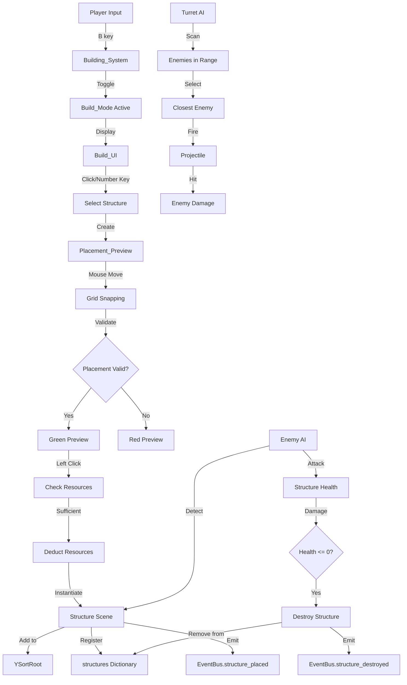
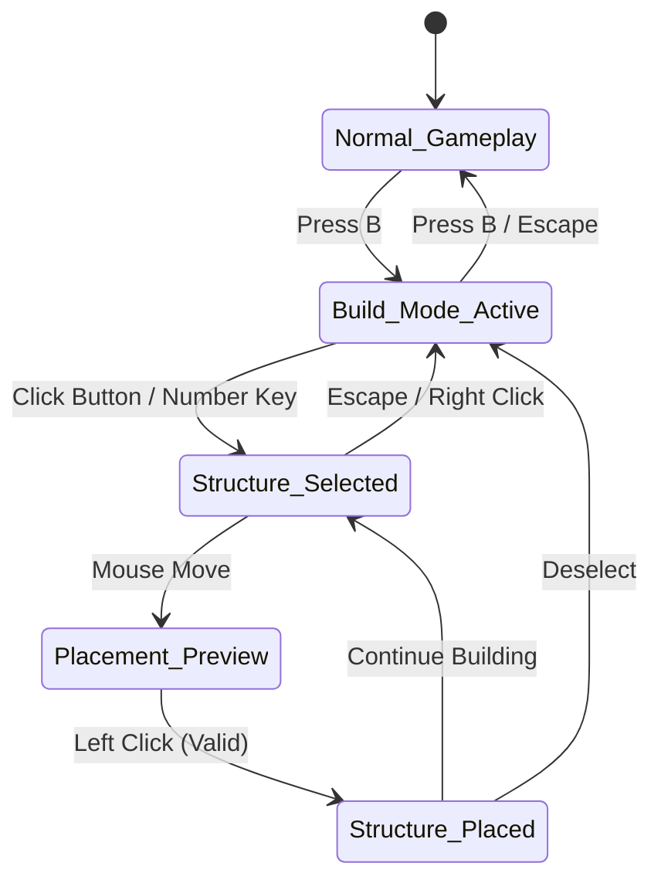
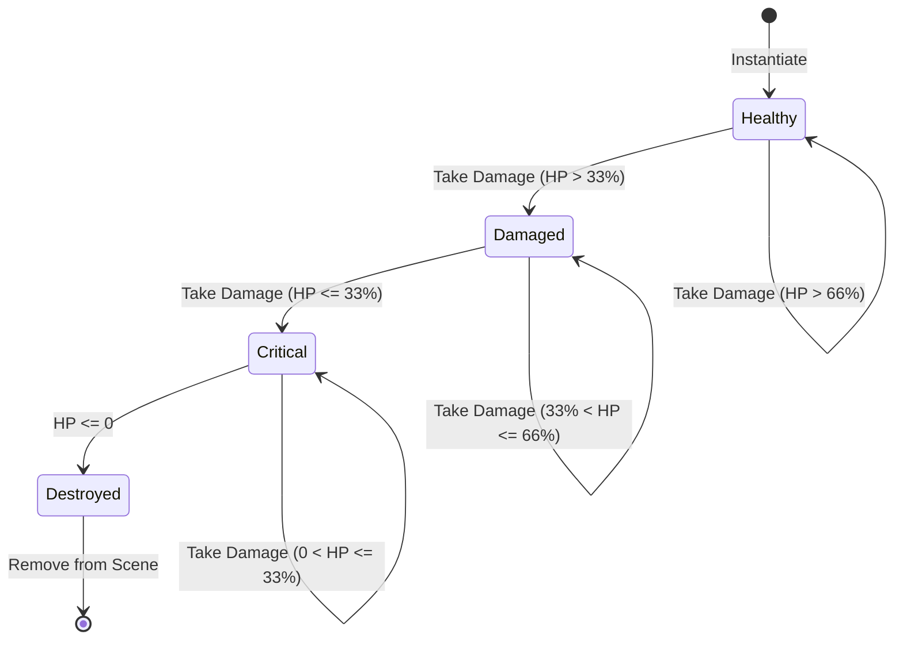

# Design Document: Building/Base Building System

## Overview

The Building/Base Building System enables players to construct defensive structures on the game map using gathered resources. The system provides a dedicated build mode where players can preview, place, and manage four structure types: Walls, Turrets, Crafting Stations, and Storage Chests. Structures occupy grid cells on the 30x30 tile map, have health points, can be damaged by enemies, and persist between game sessions.

This system integrates deeply with existing game systems including ResourceManager (resource costs), EventBus (signal-driven communication), YSortRoot (proper rendering order), Enemy AI (structure targeting), and the Save System (persistence). The design follows established patterns from the HarvestableObject and LootSystem implementations, using state machines, Area2D detection, and autoload singletons.

### Key Design Goals

1. **Intuitive Build Mode**: Toggle build mode with B key, clear visual feedback for placement validity
2. **Grid-Based Placement**: Snap structures to 16x16 pixel grid cells with collision detection
3. **Resource Integration**: Spend wood/stone from ResourceManager to place structures
4. **Defensive Gameplay**: Turrets auto-attack enemies, structures can be damaged and destroyed
5. **Strategic Depth**: Four structure types with different costs, sizes, and functions
6. **Persistence**: Save/load structure positions, health, and inventory contents
7. **Performance**: Support 100 structures with optimized collision detection and turret AI

## Architecture

### System Components

```
Building/Base Building System Architecture
├── Building_System (Autoload Singleton)
│   ├── Build Mode Management
│   ├── Structure Selection & Preview
│   ├── Placement Validation
│   ├── Structure Instantiation
│   ├── Structure Registry (Dictionary)
│   └── Demolition System
├── Build_UI (CanvasLayer Scene)
│   ├── Structure Buttons (4 types)
│   ├── Resource Display
│   ├── Build Mode Indicator
│   └── Error Message Display
├── Structure Base Class (extends Area2D)
│   ├── Health System Component
│   ├── Visual Feedback Component
│   ├── Collision Detection
│   └── Save/Load Interface
├── Structure Types (4 Scenes)
│   ├── Wall (1x1 grid, 100 HP, 10 wood)
│   ├── Turret (1x1 grid, 150 HP, 15 wood + 10 stone, AI)
│   ├── Crafting_Station (2x2 grid, 200 HP, 20 wood + 15 stone)
│   └── Storage_Chest (2x2 grid, 150 HP, 25 wood, 20-slot inventory)
├── Turret_AI Component
│   ├── Enemy Scanning (150px range)
│   ├── Target Selection (closest enemy)
│   ├── Rotation & Firing
│   └── Projectile System
├── Placement_Preview (Node2D)
│   ├── Ghost Sprite (50% opacity)
│   ├── Grid Snapping
│   └── Color Feedback (green/red)
└── Integration Points
    ├── ResourceManager (resource costs)
    ├── EventBus (signals)
    ├── YSortRoot (rendering order)
    ├── Enemy_AI (structure targeting)
    └── Save_System (persistence)
```

### Data Flow Diagram



### State Machine: Build Mode



### State Machine: Structure Health



## Components and Interfaces

### 1. Building_System (Autoload Singleton)

**Purpose**: Central manager for build mode, structure placement, validation, and registry.

**Responsibilities**:
- Toggle build mode on/off
- Manage structure selection and preview
- Validate placement positions
- Instantiate and register structures
- Handle demolition
- Enforce structure limit (100 max)

**Key Properties**:
```gdscript
var build_mode_active: bool = false
var selected_structure_type: String = ""
var placement_preview: Node2D = null
var structures: Dictionary = {}  # Key: Vector2i grid_pos, Value: Structure node
var structure_count: int = 0
const MAX_STRUCTURES: int = 100
const GRID_SIZE: int = 16  # pixels per grid cell
```

**Key Methods**:
```gdscript
func toggle_build_mode() -> void
func select_structure(type: String) -> void
func deselect_structure() -> void
func update_preview_position(mouse_pos: Vector2) -> void
func validate_placement(grid_pos: Vector2i, grid_size: Vector2i) -> Dictionary
func place_structure(grid_pos: Vector2i) -> bool
func demolish_structure(grid_pos: Vector2i) -> void
func world_to_grid(world_pos: Vector2) -> Vector2i
func grid_to_world(grid_pos: Vector2i) -> Vector2
func get_structure_at_position(grid_pos: Vector2i) -> Node2D
func register_structure(grid_pos: Vector2i, structure: Node2D) -> void
func unregister_structure(grid_pos: Vector2i) -> void
```

**Signals Emitted**:
- `EventBus.build_mode_changed(active: bool)`
- `EventBus.structure_placed(type: String, position: Vector2)`
- `EventBus.structure_destroyed(type: String, position: Vector2)`
- `EventBus.structure_demolished(type: String, position: Vector2)`

### 2. Build_UI (CanvasLayer Scene)

**Purpose**: Display available structures, resource costs, and build mode status.

**Scene Structure**:
```
Build_UI (CanvasLayer)
└── Panel (Control)
    ├── VBoxContainer
    │   ├── ResourceDisplay (HBoxContainer)
    │   │   ├── WoodLabel (Label)
    │   │   └── StoneLabel (Label)
    │   ├── StructureButtons (GridContainer, 2 columns)
    │   │   ├── WallButton (Button)
    │   │   ├── TurretButton (Button)
    │   │   ├── CraftingStationButton (Button)
    │   │   └── StorageChestButton (Button)
    │   └── InfoLabel (Label)
    └── ErrorMessage (Label)
```

**Key Methods**:
```gdscript
func show_build_ui() -> void
func hide_build_ui() -> void
func update_resource_display() -> void
func update_button_states() -> void
func highlight_button(type: String) -> void
func clear_button_highlights() -> void
func show_error_message(message: String) -> void
func _on_structure_button_pressed(type: String) -> void
```

**Button Data**:
- Wall: Icon (placeholder ColorRect), "Wall", "10 Wood"
- Turret: Icon, "Turret", "15 Wood, 10 Stone"
- Crafting Station: Icon, "Crafting Station", "20 Wood, 15 Stone"
- Storage Chest: Icon, "Storage Chest", "25 Wood"

### 3. Structure Base Class

**Purpose**: Base class for all placeable structures with common functionality.

**Class Definition**:
```gdscript
extends Area2D
class_name Structure

# Structure properties
@export var structure_type: String = "wall"
@export var max_health: int = 100
@export var grid_size: Vector2i = Vector2i(1, 1)
@export var resource_costs: Dictionary = {"wood": 10}

# Runtime state
var current_health: int = 100
var grid_position: Vector2i = Vector2i(0, 0)
var is_destroyed: bool = false

# Node references
@onready var visual: ColorRect = $Visual
@onready var health_bar: ProgressBar = $HealthBar
@onready var collision_shape: CollisionShape2D = $CollisionShape2D
```

**Key Methods**:
```gdscript
func _ready() -> void
func initialize(grid_pos: Vector2i) -> void
func take_damage(amount: int) -> void
func update_health_bar() -> void
func update_visual_feedback() -> void
func destroy() -> void
func get_save_data() -> Dictionary
func load_from_data(data: Dictionary) -> void
```

**Health Color Modulation**:
- HP > 66%: White (Color(1, 1, 1))
- 33% < HP <= 66%: Yellow (Color(1, 1, 0))
- HP <= 33%: Red (Color(1, 0, 0))

### 4. Wall Structure

**Properties**:
- Type: "wall"
- Max Health: 100
- Grid Size: 1x1 (16x16 pixels)
- Cost: 10 wood
- Visual: Brown ColorRect (16x16)
- Collision: RectangleShape2D (16x16)

**Functionality**:
- Blocks enemy movement (collision layer 4)
- Can be damaged by enemies
- No special abilities

### 5. Turret Structure

**Properties**:
- Type: "turret"
- Max Health: 150
- Grid Size: 1x1 (16x16 pixels)
- Cost: 15 wood + 10 stone
- Visual: Gray ColorRect (16x16) with directional indicator
- Collision: RectangleShape2D (16x16)
- Rotation: Supports 90-degree rotation (affects firing direction)

**Turret_AI Component**:
```gdscript
extends Node
class_name TurretAI

const SCAN_RANGE: float = 150.0
const ATTACK_COOLDOWN: float = 1.5
const PROJECTILE_SPEED: float = 200.0
const PROJECTILE_DAMAGE: int = 15
const PROJECTILE_MAX_DISTANCE: float = 200.0

var current_target: Node2D = null
var attack_cooldown_timer: float = 0.0
var scan_timer: float = 0.0
const SCAN_INTERVAL: float = 0.5

func _process(delta: float) -> void
func scan_for_enemies() -> void
func select_closest_enemy(enemies: Array) -> Node2D
func rotate_to_target(delta: float) -> void
func fire_projectile() -> void
func is_target_valid() -> bool
```

**Projectile Scene**:
```
TurretProjectile (Area2D)
├── Visual (ColorRect, 4x4, yellow)
├── CollisionShape2D (CircleShape2D, radius 2)
└── Script (turret_projectile.gd)
```

**Projectile Behavior**:
- Moves toward target position at 200 px/s
- Collision mask: Layer 2 (enemies)
- On hit: Deal 15 damage, destroy self
- Max travel: 200 pixels, then destroy self

### 6. Crafting_Station Structure

**Properties**:
- Type: "crafting_station"
- Max Health: 200
- Grid Size: 2x2 (32x32 pixels)
- Cost: 20 wood + 15 stone
- Visual: Orange ColorRect (32x32)
- Collision: RectangleShape2D (32x32)

**Interaction System**:
```gdscript
var player_in_range: bool = false
var interaction_indicator: ColorRect  # White bar above structure

func _on_body_entered(body: Node2D) -> void:
    if body.is_in_group("player"):
        player_in_range = true
        interaction_indicator.visible = true

func _on_body_exited(body: Node2D) -> void:
    if body.is_in_group("player"):
        player_in_range = false
        interaction_indicator.visible = false

func _process(delta: float) -> void:
    if player_in_range and Input.is_action_just_pressed("interact"):
        open_crafting_ui()

func open_crafting_ui() -> void:
    EventBus.crafting_station_opened.emit()
    # Display placeholder message: "Crafting UI - Coming Soon"
```

### 7. Storage_Chest Structure

**Properties**:
- Type: "storage_chest"
- Max Health: 150
- Grid Size: 2x2 (32x32 pixels)
- Cost: 25 wood
- Visual: Blue ColorRect (32x32)
- Collision: RectangleShape2D (32x32)
- Inventory: 20 slots (separate from player inventory)

**Inventory System**:
```gdscript
var chest_inventory: Array = []  # Array of 20 slots
const INVENTORY_SIZE: int = 20

func initialize_inventory() -> void:
    chest_inventory.resize(INVENTORY_SIZE)
    for i in range(INVENTORY_SIZE):
        chest_inventory[i] = null

func add_item(item_id: String, quantity: int) -> bool
func remove_item(slot_index: int) -> Dictionary
func get_item(slot_index: int) -> Dictionary
func is_inventory_full() -> bool
func get_save_data() -> Dictionary  # Includes inventory
func load_from_data(data: Dictionary) -> void  # Restores inventory
```

**Interaction System**:
- Similar to Crafting_Station (50px range, E key)
- Opens chest inventory UI (20-slot grid)
- Allows drag-and-drop between player and chest inventories
- On destroy: Drop all items as PickupItems

### 8. Placement_Preview

**Purpose**: Visual ghost of selected structure that follows mouse cursor.

**Scene Structure**:
```
Placement_Preview (Node2D)
├── Visual (ColorRect)
│   └── Modulate: Color(1, 1, 1, 0.5)  # 50% opacity
└── GridIndicator (Node2D)
    └── [Grid cell outlines for multi-cell structures]
```

**Key Methods**:
```gdscript
func set_structure_type(type: String) -> void
func update_position(mouse_pos: Vector2) -> void
func set_valid(is_valid: bool) -> void  # Green if valid, red if invalid
func show_preview() -> void
func hide_preview() -> void
```

**Color States**:
- Valid placement: Color(0, 1, 0, 0.5) - Green, 50% opacity
- Invalid placement: Color(1, 0, 0, 0.5) - Red, 50% opacity

## Data Models

### structures.json

**File Path**: `data/structures.json`

**Format**:
```json
{
  "wall": {
    "name": "Wall",
    "max_health": 100,
    "costs": {
      "wood": 10
    },
    "grid_size": {
      "x": 1,
      "y": 1
    },
    "scene_path": "res://scenes/structures/Wall.tscn"
  },
  "turret": {
    "name": "Turret",
    "max_health": 150,
    "costs": {
      "wood": 15,
      "stone": 10
    },
    "grid_size": {
      "x": 1,
      "y": 1
    },
    "scene_path": "res://scenes/structures/Turret.tscn",
    "can_rotate": true
  },
  "crafting_station": {
    "name": "Crafting Station",
    "max_health": 200,
    "costs": {
      "wood": 20,
      "stone": 15
    },
    "grid_size": {
      "x": 2,
      "y": 2
    },
    "scene_path": "res://scenes/structures/CraftingStation.tscn"
  },
  "storage_chest": {
    "name": "Storage Chest",
    "max_health": 150,
    "costs": {
      "wood": 25
    },
    "grid_size": {
      "x": 2,
      "y": 2
    },
    "scene_path": "res://scenes/structures/StorageChest.tscn"
  }
}
```

### Structure Save Data Format

**Used by Save_System for persistence**:

```json
{
  "structures": [
    {
      "type": "wall",
      "grid_position": {"x": 10, "y": 15},
      "current_health": 75,
      "rotation": 0
    },
    {
      "type": "turret",
      "grid_position": {"x": 12, "y": 15},
      "current_health": 150,
      "rotation": 90
    },
    {
      "type": "storage_chest",
      "grid_position": {"x": 8, "y": 10},
      "current_health": 120,
      "inventory": [
        {"item_id": "chrono_dust", "quantity": 5},
        null,
        {"item_id": "health_potion", "quantity": 2},
        null,
        ...
      ]
    }
  ]
}
```

### Building_System Internal Data Structures

**structures Dictionary**:
```gdscript
# Key: Vector2i grid position
# Value: Structure node reference
var structures: Dictionary = {
    Vector2i(10, 15): <Wall#12345>,
    Vector2i(12, 15): <Turret#12346>,
    Vector2i(8, 10): <StorageChest#12347>
}
```

**Spatial Partitioning Grid** (for optimization):
```gdscript
# Divide 30x30 map into 6x6 sectors (5x5 grid cells each)
var spatial_grid: Dictionary = {
    Vector2i(0, 0): [<Structure>, <Structure>, ...],
    Vector2i(1, 0): [<Structure>, ...],
    ...
}
```

## Integration Points

### 1. ResourceManager Integration

**Resource Deduction**:
```gdscript
# In Building_System.place_structure()
var costs = structure_data["costs"]
for resource_type in costs:
    var amount = costs[resource_type]
    if not ResourceManager.spend_resource(resource_type, amount):
        return false  # Insufficient resources
```

**Resource Refund** (demolition):
```gdscript
# In Building_System.demolish_structure()
var costs = structure_data["costs"]
for resource_type in costs:
    var refund_amount = int(costs[resource_type] * 0.5)  # 50% refund
    ResourceManager.add_resource(resource_type, refund_amount)
```

### 2. EventBus Integration

**New Signals to Add**:
```gdscript
# In EventBus.gd
signal build_mode_changed(active: bool)
signal structure_placed(type: String, position: Vector2)
signal structure_destroyed(type: String, position: Vector2)
signal structure_demolished(type: String, position: Vector2)
signal crafting_station_opened()
signal storage_chest_opened(chest: Node2D)
signal storage_chest_closed()
```

**Signal Connections**:
- Build_UI connects to `build_mode_changed` to show/hide UI
- HUD connects to `structure_placed` to show feedback
- Save_System connects to structure signals for auto-save triggers

### 3. YSortRoot Integration

**Adding Structures to Scene**:
```gdscript
# In Building_System.place_structure()
var structure = structure_scene.instantiate()
structure.global_position = grid_to_world(grid_pos)
get_tree().current_scene.get_node("YSortRoot").add_child(structure)
```

**Y-Sort Behavior**:
- Structures use `y_sort_enabled = true`
- Structures render in correct order with player, enemies, and harvestable objects
- Multi-cell structures (2x2) use center position for Y-sort

### 4. Enemy_AI Integration

**Structure Detection** (in enemy_states/chase_state.gd):
```gdscript
func detect_targets() -> Array:
    var targets = []
    
    # Detect player
    var player = get_tree().get_first_node_in_group("player")
    if player and enemy.global_position.distance_to(player.global_position) < 100:
        targets.append({"node": player, "distance": enemy.global_position.distance_to(player.global_position)})
    
    # Detect structures
    var structures = get_tree().get_nodes_in_group("structures")
    for structure in structures:
        var distance = enemy.global_position.distance_to(structure.global_position)
        if distance < 100:
            targets.append({"node": structure, "distance": distance})
    
    return targets

func select_closest_target(targets: Array) -> Node2D:
    if targets.is_empty():
        return null
    
    targets.sort_custom(func(a, b): return a["distance"] < b["distance"])
    return targets[0]["node"]
```

**Structure Damage** (in enemy_states/attack_state.gd):
```gdscript
func deal_damage() -> void:
    if target.has_method("take_damage"):
        target.take_damage(enemy.attack_damage)
        EventBus.damage_dealt.emit(target, enemy.attack_damage)
```

### 5. Save_System Integration

**Save Structures**:
```gdscript
# In Save_System
func save_structures() -> Array:
    var structure_data = []
    var structures = get_tree().get_nodes_in_group("structures")
    for structure in structures:
        structure_data.append(structure.get_save_data())
    return structure_data
```

**Load Structures**:
```gdscript
# In Save_System
func load_structures(structure_data: Array) -> void:
    for data in structure_data:
        Building_System.load_structure_from_data(data)
```

## Correctness Properties

*A property is a characteristic or behavior that should hold true across all valid executions of a system—essentially, a formal statement about what the system should do. Properties serve as the bridge between human-readable specifications and machine-verifiable correctness guarantees.*

### Assessment: Property-Based Testing Applicability

The Building/Base Building System involves:
- **UI interactions** (build mode toggle, structure selection, mouse input)
- **Spatial validation** (grid snapping, collision detection, bounds checking)
- **State management** (build mode states, structure health states)
- **Resource transactions** (deduction, refunds)
- **Scene instantiation** (structure placement, projectile spawning)

**PBT Applicability Analysis**:
- ✅ **Resource validation logic**: Pure functions checking costs vs available resources
- ✅ **Grid coordinate conversion**: Pure functions (world_to_grid, grid_to_world)
- ✅ **Placement validation logic**: Testable with mocked collision detection
- ✅ **Health calculation**: Pure functions for damage, color modulation
- ❌ **UI rendering**: Not suitable for PBT (use snapshot tests)
- ❌ **Scene instantiation**: Side effects, not suitable for PBT
- ❌ **Godot Area2D collision**: External system behavior

**Conclusion**: PBT IS appropriate for core logic functions (resource validation, grid math, placement rules, health calculations), but NOT for UI rendering, scene management, or Godot engine interactions. We will write properties for the testable pure logic and use example-based tests for integration points.

### Prework Analysis

Now I'll use the prework tool to analyze acceptance criteria for testability:

<function_calls>
<invoke name="prework">
<parameter name="featureName">building-base-system


## Property Reflection

After analyzing all acceptance criteria, I've identified the following testable properties. Now I'll perform property reflection to eliminate redundancy:

**Redundancy Analysis**:

1. **Grid Snapping (3.2 and 17.1)**: Both test coordinate conversion between world and grid space. These can be combined into a single comprehensive property about bidirectional coordinate transformation.

2. **Structure Registry (5.4, 7.4, 15.3)**: All three test that structures are properly registered/unregistered in the dictionary. These can be combined into properties about registry invariants.

3. **Overlap Detection (4.2 and 4.3)**: Both test spatial overlap detection, just with different object types. These can be combined into a single property about spatial collision detection.

4. **Target Selection (8.2 and 9.2)**: Both test selecting the closest target from a set. These can be combined into a single property about distance-based selection.

5. **Health Color Modulation (16.1, 16.2, 16.3)**: All three test color based on health percentage. These can be combined into a single comprehensive property about health-to-color mapping.

6. **Item Dropping on Destruction (12.7 and 15.5)**: Both test that chest items are dropped when chest is destroyed/demolished. These are the same behavior and can be combined.

7. **Validation Return Type (4.5)**: This is implied by other validation properties and doesn't need a separate property.

8. **Button Display (14.2, 14.3, 14.4)**: These can be combined into a single property about button state based on resource availability.

**Properties to Keep** (after eliminating redundancy):
- Grid coordinate conversion (bidirectional)
- Bounds checking
- Spatial overlap detection (general)
- Resource validation
- Resource deduction on placement
- Structure registry invariants
- Health initialization
- Health damage calculation
- Target selection (closest)
- Turret rotation toward target
- Projectile velocity
- Projectile lifetime
- Structure save data completeness
- Chest inventory round-trip
- Save data validation
- Health-to-color modulation mapping
- Refund calculation
- Collision shape sizing
- Structure data schema validation
- Rotation increment

### Correctness Properties

Property 1: Grid Coordinate Bidirectional Conversion
*For any* world position, converting to grid coordinates and back to world coordinates should produce a position on the grid boundary (snapped to 16px increments)
**Validates: Requirements 3.2, 17.1**

Property 2: Bounds Checking Correctness
*For any* grid position and structure grid size, the bounds check should return true if and only if all occupied cells have coordinates in range [0, 29]
**Validates: Requirements 4.1**

Property 3: Spatial Overlap Detection
*For any* two rectangular regions defined by grid position and grid size, the overlap detection should return true if and only if the regions share at least one grid cell
**Validates: Requirements 4.2, 4.3**

Property 4: Resource Sufficiency Check
*For any* structure cost dictionary and current resource amounts, the sufficiency check should return true if and only if all resource types have amounts greater than or equal to their costs
**Validates: Requirements 4.4**

Property 5: Resource Deduction Accuracy
*For any* structure placement with sufficient resources, the resource amounts after placement should equal the amounts before placement minus the structure costs
**Validates: Requirements 5.2**

Property 6: Structure Registry Consistency
*For any* placed structure, the structures dictionary should contain an entry at the structure's grid position that references the structure node, and removing the structure should remove that entry
**Validates: Requirements 5.4, 7.4, 15.3**

Property 7: Health Initialization
*For any* structure type, a newly instantiated structure should have current_health equal to max_health as defined in structures.json
**Validates: Requirements 7.1**

Property 8: Health Damage Calculation
*For any* structure with current health H and damage amount D (where D < H), after taking damage, the structure's current health should equal H - D
**Validates: Requirements 7.2**

Property 9: Closest Target Selection
*For any* set of targets with positions, the selected target should be the one with minimum distance to the selector's position
**Validates: Requirements 8.2, 9.2**

Property 10: Turret Rotation Toward Target
*For any* turret position and target position, the turret's rotation angle should point toward the target (within a small epsilon for floating point comparison)
**Validates: Requirements 9.3**

Property 11: Projectile Velocity Magnitude
*For any* projectile moving toward a target position, the velocity vector magnitude should equal 200 pixels per second
**Validates: Requirements 10.2**

Property 12: Projectile Lifetime Distance
*For any* projectile, it should be removed from the scene after traveling 200 pixels from its spawn position
**Validates: Requirements 10.4**

Property 13: Chest Item Dropping on Destruction
*For any* Storage_Chest with N items in inventory, when the chest is destroyed or demolished, exactly N PickupItems should be spawned at the chest position
**Validates: Requirements 12.7, 15.5**

Property 14: Structure Save Data Completeness
*For any* structure, the save data dictionary returned by get_save_data() should contain all required fields: type, grid_position, current_health, and rotation
**Validates: Requirements 13.1**

Property 15: Chest Inventory Serialization Round-Trip
*For any* Storage_Chest with inventory contents, saving the chest data and loading it into a new chest should result in identical inventory contents (item IDs and quantities)
**Validates: Requirements 13.2, 13.4**

Property 16: Save Data Position Validation
*For any* structure save data, the validation function should reject data with grid positions outside map bounds [0, 29] or positions that overlap with existing structures
**Validates: Requirements 13.5**

Property 17: Health-to-Color Modulation Mapping
*For any* structure with current health H and max health M, the color modulation should be white if H/M > 0.66, yellow if 0.33 < H/M <= 0.66, and red if H/M <= 0.33
**Validates: Requirements 16.1, 16.2, 16.3**

Property 18: Demolition Refund Calculation
*For any* structure type with resource costs, the refund amount for each resource should equal int(cost * 0.5) (50% rounded down)
**Validates: Requirements 15.2**

Property 19: Collision Shape Size Matching
*For any* structure type with grid_size (W, H), the collision shape dimensions should equal (W * 16, H * 16) pixels
**Validates: Requirements 18.3**

Property 20: Structure Data Schema Validation
*For any* structure entry in structures.json, the entry should contain all required fields: name (string), max_health (int), costs (dictionary), grid_size (dictionary with x and y), and scene_path (string)
**Validates: Requirements 19.2, 19.4**

Property 21: Rotation Increment
*For any* initial rotation angle R, pressing the rotate key should result in rotation angle (R + 90) mod 360
**Validates: Requirements 17.4**

Property 22: Button State Based on Resources
*For any* structure type and current resource amounts, the structure button should be enabled (opacity 1.0) if resources are sufficient, and disabled (opacity 0.5) if resources are insufficient
**Validates: Requirements 14.3, 14.4**

## Error Handling

### Input Validation Errors

**Invalid Structure Type**:
- **Trigger**: Player attempts to select a structure type not defined in structures.json
- **Handling**: Log error, display message "Invalid structure type", prevent selection
- **Recovery**: Player can select a valid structure type

**Insufficient Resources**:
- **Trigger**: Player attempts to place structure without sufficient resources
- **Handling**: Display error message "Insufficient resources: Need X wood, Y stone", prevent placement
- **Recovery**: Player can gather more resources or select a cheaper structure

**Invalid Placement Position**:
- **Trigger**: Player attempts to place structure at invalid position (out of bounds, overlapping, etc.)
- **Handling**: Display red preview, show error message explaining reason, prevent placement
- **Recovery**: Player can move preview to valid position

**Structure Limit Reached**:
- **Trigger**: Player attempts to place structure when 100 structures already exist
- **Handling**: Display error message "Structure limit reached (100/100)", prevent placement
- **Recovery**: Player must demolish existing structures to make room

### Runtime Errors

**Missing Structure Scene**:
- **Trigger**: structures.json references a scene_path that doesn't exist
- **Handling**: Log error, display message "Failed to load structure scene", prevent placement
- **Recovery**: Fix structures.json or add missing scene file

**Invalid Save Data**:
- **Trigger**: Loading save data with invalid structure positions or missing fields
- **Handling**: Log warning, skip invalid structures, continue loading valid structures
- **Recovery**: Valid structures load successfully, invalid ones are discarded

**Turret Target Lost**:
- **Trigger**: Turret's target enemy is destroyed or moves out of range
- **Handling**: Clear target reference, resume scanning for new targets
- **Recovery**: Turret automatically acquires new target when available

**Chest Inventory Overflow**:
- **Trigger**: Attempting to add item to full chest (20 slots occupied)
- **Handling**: Display message "Chest is full", prevent item transfer
- **Recovery**: Player can remove items from chest to make room

### Collision and Physics Errors

**Overlapping Structures**:
- **Trigger**: Attempting to place structure that overlaps existing structure or harvestable object
- **Handling**: Display red preview, show error "Cannot place here: Overlapping with existing object"
- **Recovery**: Player moves preview to non-overlapping position

**Out of Bounds Placement**:
- **Trigger**: Attempting to place structure partially or fully outside map bounds (0-29 grid)
- **Handling**: Display red preview, show error "Cannot place here: Out of bounds"
- **Recovery**: Player moves preview to position within bounds

### Performance Safeguards

**Turret AI Staggering**:
- **Trigger**: More than 10 turrets exist in scene
- **Handling**: Stagger turret AI updates across frames (max 10 per frame)
- **Recovery**: All turrets still function, just with distributed processing

**Structure Limit Warning**:
- **Trigger**: Player places 51st structure (approaching 100 limit)
- **Handling**: Display warning "Approaching structure limit (51/100)"
- **Recovery**: Player is aware of approaching limit and can plan accordingly

## Testing Strategy

### Unit Testing Approach

The Building/Base Building System will use a **dual testing approach** combining property-based tests for core logic and example-based tests for integration points.

**Property-Based Testing** (using GUT + custom property test framework):
- Test universal properties across randomized inputs
- Minimum 100 iterations per property test
- Focus on pure logic functions (coordinate conversion, validation, calculations)
- Each test tagged with: `# Feature: building-base-system, Property X: [property text]`

**Example-Based Unit Testing** (using GUT):
- Test specific scenarios and edge cases
- Test integration with Godot systems (signals, scene tree, collision)
- Test UI interactions and visual feedback
- Test state transitions and error handling

### Property Test Implementation

**Property Test Framework**:
```gdscript
# test_building_system_properties.gd
extends GutTest

const PROPERTY_TEST_ITERATIONS = 100

func test_property_1_grid_coordinate_conversion():
    # Feature: building-base-system, Property 1: Grid Coordinate Bidirectional Conversion
    for i in range(PROPERTY_TEST_ITERATIONS):
        var world_pos = Vector2(randf_range(0, 480), randf_range(0, 480))
        var grid_pos = Building_System.world_to_grid(world_pos)
        var snapped_world_pos = Building_System.grid_to_world(grid_pos)
        
        # Verify snapped position is on 16px grid boundary
        assert_eq(int(snapped_world_pos.x) % 16, 0, "X should be on grid boundary")
        assert_eq(int(snapped_world_pos.y) % 16, 0, "Y should be on grid boundary")

func test_property_2_bounds_checking():
    # Feature: building-base-system, Property 2: Bounds Checking Correctness
    for i in range(PROPERTY_TEST_ITERATIONS):
        var grid_pos = Vector2i(randi_range(-5, 35), randi_range(-5, 35))
        var grid_size = Vector2i(randi_range(1, 3), randi_range(1, 3))
        var result = Building_System.is_within_bounds(grid_pos, grid_size)
        
        # Manually verify all cells are in bounds
        var expected = true
        for x in range(grid_size.x):
            for y in range(grid_size.y):
                var cell = grid_pos + Vector2i(x, y)
                if cell.x < 0 or cell.x > 29 or cell.y < 0 or cell.y > 29:
                    expected = false
                    break
        
        assert_eq(result, expected, "Bounds check should match manual verification")

# ... Additional property tests for Properties 3-22
```

**Test Coverage by Property**:
- Properties 1-6: Core placement logic (grid math, validation, resources)
- Properties 7-8: Health system logic
- Properties 9-12: Turret AI logic (targeting, rotation, projectiles)
- Properties 13-16: Save/load system logic
- Properties 17-22: Visual feedback, demolition, collision, data validation

### Example-Based Unit Tests

**Structure Health Tests**:
```gdscript
func test_structure_takes_damage():
    var wall = preload("res://scenes/structures/Wall.tscn").instantiate()
    add_child_autofree(wall)
    wall.initialize(Vector2i(10, 10))
    
    var initial_health = wall.current_health
    wall.take_damage(25)
    
    assert_eq(wall.current_health, initial_health - 25)

func test_structure_destroyed_at_zero_health():
    var wall = preload("res://scenes/structures/Wall.tscn").instantiate()
    add_child_autofree(wall)
    wall.initialize(Vector2i(10, 10))
    
    wall.take_damage(wall.max_health)
    
    await wait_frames(1)
    assert_true(wall.is_destroyed)
```

**Build Mode Tests**:
```gdscript
func test_toggle_build_mode():
    assert_false(Building_System.build_mode_active)
    
    Building_System.toggle_build_mode()
    assert_true(Building_System.build_mode_active)
    
    Building_System.toggle_build_mode()
    assert_false(Building_System.build_mode_active)

func test_structure_selection():
    Building_System.toggle_build_mode()
    Building_System.select_structure("wall")
    
    assert_eq(Building_System.selected_structure_type, "wall")
    assert_not_null(Building_System.placement_preview)
```

**Turret AI Tests**:
```gdscript
func test_turret_scans_for_enemies():
    var turret = preload("res://scenes/structures/Turret.tscn").instantiate()
    add_child_autofree(turret)
    turret.initialize(Vector2i(15, 15))
    
    var enemy = preload("res://scenes/enemies/SlimeBasic.tscn").instantiate()
    add_child_autofree(enemy)
    enemy.global_position = turret.global_position + Vector2(100, 0)
    
    await wait_seconds(0.6)  # Wait for scan interval
    
    assert_not_null(turret.turret_ai.current_target)
    assert_eq(turret.turret_ai.current_target, enemy)
```

**Storage Chest Tests**:
```gdscript
func test_chest_stores_items():
    var chest = preload("res://scenes/structures/StorageChest.tscn").instantiate()
    add_child_autofree(chest)
    chest.initialize(Vector2i(10, 10))
    
    var success = chest.add_item("chrono_dust", 5)
    
    assert_true(success)
    assert_eq(chest.chest_inventory[0]["item_id"], "chrono_dust")
    assert_eq(chest.chest_inventory[0]["quantity"], 5)

func test_chest_drops_items_on_destruction():
    var chest = preload("res://scenes/structures/StorageChest.tscn").instantiate()
    add_child_autofree(chest)
    chest.initialize(Vector2i(10, 10))
    chest.add_item("chrono_dust", 5)
    chest.add_item("health_potion", 2)
    
    chest.destroy()
    
    await wait_frames(1)
    var pickups = get_tree().get_nodes_in_group("pickups")
    assert_eq(pickups.size(), 2, "Should spawn 2 pickup items")
```

### Integration Testing

**Enemy Structure Targeting**:
- Spawn enemy and structure within 100px
- Verify enemy adds structure to targets
- Verify enemy attacks structure
- Verify structure takes damage

**Resource Integration**:
- Set ResourceManager resources to known amounts
- Place structure
- Verify ResourceManager resources decreased by cost
- Demolish structure
- Verify ResourceManager resources increased by refund

**Save/Load Integration**:
- Place multiple structures with varying health
- Place Storage_Chest with items
- Save game
- Clear scene
- Load game
- Verify all structures restored with correct positions, health, and inventory

### Manual Testing Checklist

**Build Mode**:
- [ ] Press B to toggle build mode on/off
- [ ] Build UI appears/disappears correctly
- [ ] Player movement disabled in build mode
- [ ] Attack and chrono rift disabled in build mode

**Structure Placement**:
- [ ] Select structure with button click
- [ ] Select structure with number keys (1-4)
- [ ] Preview follows mouse cursor
- [ ] Preview snaps to grid
- [ ] Preview shows green when valid, red when invalid
- [ ] Cannot place out of bounds
- [ ] Cannot place overlapping existing structures
- [ ] Cannot place overlapping harvestable objects
- [ ] Cannot place with insufficient resources
- [ ] Resources deducted on placement
- [ ] Structure appears in scene at correct position
- [ ] Structure renders in correct Y-sort order

**Structure Demolition**:
- [ ] Hold X and click structure to demolish
- [ ] 50% resources refunded
- [ ] Structure removed from scene
- [ ] Chest drops items on demolition

**Structure Health**:
- [ ] Health bar displays above structure
- [ ] Health bar updates when damaged
- [ ] Color changes: white > 66%, yellow 33-66%, red < 33%
- [ ] Flash white when damaged
- [ ] Destroy at 0 health
- [ ] Destruction particle effect plays

**Turret AI**:
- [ ] Turret scans for enemies in 150px range
- [ ] Turret selects closest enemy
- [ ] Turret rotates to face target
- [ ] Turret fires projectile every 1.5 seconds
- [ ] Projectile moves toward target at 200 px/s
- [ ] Projectile deals 15 damage on hit
- [ ] Projectile despawns after 200px travel
- [ ] Turret clears target when out of range

**Enemy Structure Targeting**:
- [ ] Enemy detects structures within 100px
- [ ] Enemy prioritizes closer target (player vs structure)
- [ ] Enemy attacks structure
- [ ] Structure takes damage from enemy
- [ ] Enemy clears target when structure destroyed

**Crafting Station Interaction**:
- [ ] Interaction indicator appears within 50px
- [ ] Press E to interact
- [ ] Placeholder message displays
- [ ] Indicator hides when player moves away

**Storage Chest Interaction**:
- [ ] Interaction indicator appears within 50px
- [ ] Press E to open chest inventory
- [ ] 20-slot grid displays
- [ ] Drag items from player to chest
- [ ] Drag items from chest to player
- [ ] Chest closes when player moves away
- [ ] Chest closes when press Escape
- [ ] Chest drops items on destruction

**Save/Load**:
- [ ] Placed structures persist after save/load
- [ ] Structure health persists
- [ ] Turret rotation persists
- [ ] Chest inventory persists
- [ ] Invalid save data handled gracefully

**Performance**:
- [ ] 100 structures can be placed
- [ ] Error message at structure limit
- [ ] Warning message at 50+ structures
- [ ] Multiple turrets don't cause lag
- [ ] Turret AI staggering works with 10+ turrets

### Test File Organization

```
tests/
├── building_system/
│   ├── test_building_system_properties.gd (22 property tests)
│   ├── test_building_system_core.gd (build mode, selection, placement)
│   ├── test_structure_health.gd (health system, damage, destruction)
│   ├── test_turret_ai.gd (scanning, targeting, firing, projectiles)
│   ├── test_structure_interaction.gd (crafting station, storage chest)
│   ├── test_demolition.gd (demolition, refunds)
│   ├── test_save_load.gd (serialization, deserialization)
│   ├── test_enemy_integration.gd (enemy targeting structures)
│   └── test_resource_integration.gd (resource costs, refunds)
```

### Continuous Testing

**Pre-Commit Tests**:
- Run all property tests (22 tests, ~2200 iterations total)
- Run all example-based unit tests
- Verify no errors or warnings

**Integration Test Suite**:
- Run after major changes
- Test all integration points
- Verify no regressions in existing systems

**Manual Test Pass**:
- Complete manual testing checklist
- Test on target platform (HTML5)
- Verify performance with 100 structures

## Implementation Notes

### Development Order

**Phase 1: Core Building System** (Foundation)
1. Create Building_System autoload
2. Implement build mode toggle
3. Implement grid coordinate conversion
4. Create structures.json data file
5. Implement placement validation logic
6. Write property tests for core logic

**Phase 2: Structure Base Class** (Common Functionality)
1. Create Structure base class
2. Implement health system
3. Implement visual feedback (health bar, color modulation)
4. Implement save/load interface
5. Write unit tests for Structure class

**Phase 3: Basic Structures** (Wall, Crafting Station, Storage Chest)
1. Create Wall scene and script
2. Create Crafting_Station scene and script
3. Create Storage_Chest scene and script
4. Implement chest inventory system
5. Implement interaction system
6. Write unit tests for each structure type

**Phase 4: Build UI** (User Interface)
1. Create Build_UI scene
2. Implement structure buttons
3. Implement resource display
4. Implement error messages
5. Connect to Building_System signals
6. Test UI responsiveness

**Phase 5: Placement System** (Preview and Placement)
1. Create Placement_Preview scene
2. Implement preview following mouse
3. Implement grid snapping
4. Implement color feedback (green/red)
5. Implement placement action
6. Implement resource deduction
7. Test placement flow end-to-end

**Phase 6: Turret and AI** (Advanced Structure)
1. Create Turret scene and script
2. Implement Turret_AI component
3. Implement enemy scanning
4. Implement target selection
5. Implement rotation
6. Create TurretProjectile scene
7. Implement projectile movement and collision
8. Write unit tests for Turret_AI
9. Test turret behavior with multiple enemies

**Phase 7: Enemy Integration** (Structure Targeting)
1. Modify Enemy_AI to detect structures
2. Implement structure targeting in Chase state
3. Implement structure damage in Attack state
4. Test enemy attacking structures
5. Test target switching between player and structures

**Phase 8: Demolition System** (Structure Removal)
1. Implement demolition input handling
2. Implement refund calculation
3. Implement structure removal
4. Implement chest item dropping
5. Write unit tests for demolition
6. Test demolition flow

**Phase 9: Save/Load Integration** (Persistence)
1. Implement Structure.get_save_data()
2. Implement Structure.load_from_data()
3. Implement chest inventory serialization
4. Integrate with Save_System
5. Write property tests for serialization
6. Test save/load round-trip

**Phase 10: Polish and Optimization** (Final Touches)
1. Implement structure limit enforcement
2. Implement turret AI staggering
3. Implement spatial partitioning for collision detection
4. Add visual effects (damage flash, destruction particles, muzzle flash)
5. Add sound effects (placement, demolition, turret fire, structure destroyed)
6. Performance testing with 100 structures
7. Final manual testing pass

### Technical Considerations

**Grid System**:
- 30x30 tile map, 16x16 pixel tiles = 480x480 pixel world
- Grid origin (0, 0) at top-left corner
- Grid position (x, y) maps to world position (x * 16 + 8, y * 16 + 8) (center of cell)

**Collision Layers**:
- Layer 1: Player
- Layer 2: Enemies
- Layer 3: Harvestable Objects
- Layer 4: Structures (NEW)
- Layer 5: Projectiles (NEW)

**Performance Optimization**:
- Spatial partitioning: Divide 30x30 grid into 6x6 sectors (5x5 cells each)
- Only check structures in relevant sectors during placement validation
- Stagger turret AI updates: Max 10 turrets process per frame
- Use object pooling for projectiles if many turrets exist

**Memory Management**:
- Structures dictionary uses Vector2i keys (lightweight)
- Projectiles auto-free after 200px travel or hit
- Chest inventory uses fixed-size array (20 slots)
- Save data uses compact dictionary format

**Godot-Specific**:
- Use `Area2D` for structures (collision detection)
- Use `CollisionShape2D` with `RectangleShape2D`
- Use `CanvasLayer` for Build_UI (always on top)
- Use `YSortRoot` for proper rendering order
- Use `Tween` for smooth animations (damage flash, destruction)

### Dependencies

**Existing Systems**:
- ResourceManager: Resource tracking and spending
- EventBus: Signal-driven communication
- DataManager: Loading structures.json
- YSortRoot: Rendering order
- Enemy_AI: Structure targeting
- Save_System: Persistence
- LootSystem: Item dropping (for chest destruction)

**New Systems**:
- Building_System (autoload)
- Structure (base class)
- Turret_AI (component)
- Build_UI (scene)
- Placement_Preview (scene)

**Data Files**:
- data/structures.json (NEW)

**Scene Files**:
- scenes/structures/Wall.tscn (NEW)
- scenes/structures/Turret.tscn (NEW)
- scenes/structures/CraftingStation.tscn (NEW)
- scenes/structures/StorageChest.tscn (NEW)
- scenes/structures/TurretProjectile.tscn (NEW)
- scenes/ui/Build_UI.tscn (NEW)
- scenes/ui/Placement_Preview.tscn (NEW)

**Script Files**:
- scripts/systems/building_system.gd (NEW, autoload)
- scripts/structures/structure.gd (NEW, base class)
- scripts/structures/wall.gd (NEW)
- scripts/structures/turret.gd (NEW)
- scripts/structures/crafting_station.gd (NEW)
- scripts/structures/storage_chest.gd (NEW)
- scripts/structures/turret_ai.gd (NEW, component)
- scripts/structures/turret_projectile.gd (NEW)
- scripts/ui/build_ui.gd (NEW)
- scripts/ui/placement_preview.gd (NEW)

### Future Enhancements

**Not in MVP, but possible future additions**:
- Structure upgrades (increase health, turret damage, etc.)
- More structure types (traps, resource generators, teleporters)
- Structure repair system (spend resources to restore health)
- Structure blueprints (save/load structure layouts)
- Structure rotation for all types (not just turrets)
- Multi-select demolition (demolish multiple structures at once)
- Structure groups (assign structures to control groups)
- Advanced turret AI (target prioritization, lead shots)
- Structure visual variants (different skins/colors)
- Structure sound effects (ambient sounds, damage sounds)
- Structure particle effects (idle effects, active effects)
- Structure tooltips (hover to see stats)
- Structure hotkeys (quick-place favorite structures)
- Structure templates (pre-designed base layouts)

---

**Design Document Version**: 1.0  
**Last Updated**: 2024-01-XX  
**Status**: Ready for Implementation
