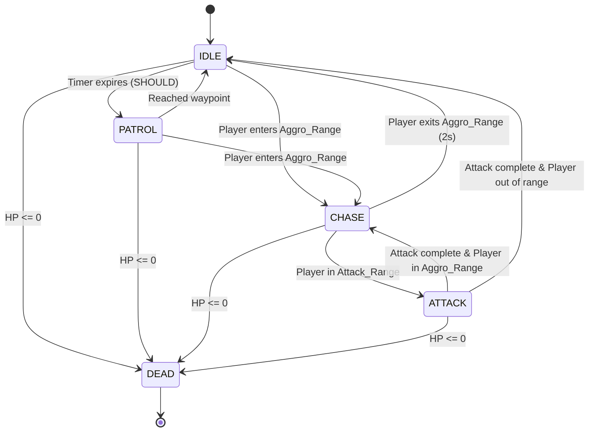

# Enemy AI System - Design Document

**Feature:** enemy-ai-system  
**Version:** 1.0  
**Status:** Draft  
**Engine:** Godot 4.x / GDScript  
**Phase:** Phase 7 - Enemy AI

---

## Overview

The Enemy AI System provides intelligent, state-driven behavior for enemies in ChronoRift. The system implements a finite state machine architecture that manages enemy behavior across five states (IDLE, PATROL, CHASE, ATTACK, DEAD), integrates with the existing Chrono Rift time manipulation mechanics, and provides a foundation for three distinct enemy types with varying combat patterns.

### Design Goals

1. **Prototype-First Approach**: Deliver a playable combat loop quickly using direct movement before adding complex pathfinding
2. **Modular Architecture**: Enable easy addition of new enemy types through inheritance and composition
3. **Chrono Rift Integration**: Seamlessly integrate with existing time manipulation systems (slow/freeze effects)
4. **Performance**: Support multiple enemies (target: 10-20 simultaneous) at 60 FPS on web platform
5. **Debuggability**: Provide clear visibility into AI state and decision-making during development

### Key Technical Decisions

- **State Machine Pattern**: Explicit state management for predictable, testable behavior
- **Direct Movement First**: Skip NavigationAgent2D initially to reduce complexity; add only if enemies get stuck
- **Isometric Coordinate Transform**: Apply same transformation as player for consistent visual movement
- **Event-Driven Damage**: Use EventBus signals for decoupled combat feedback
- **Exported Variables**: Expose all tunable parameters in Godot Inspector for rapid iteration

---

## Architecture

### System Components

```
EnemyAISystem
├── BaseEnemy (CharacterBody2D)
│   ├── EnemyStateMachine
│   │   ├── IdleState
│   │   ├── PatrolState (SHOULD priority)
│   │   ├── ChaseState
│   │   ├── AttackState
│   │   └── DeadState
│   ├── EnemyStats (Resource)
│   └── EnemyVisuals (ColorRect + Label)
├── SlimeBasic (extends BaseEnemy)
├── EarthGolem (extends BaseEnemy)
└── FireImp (extends BaseEnemy)
    └── Projectile (Area2D)
```

### State Machine Flow



### Integration Points

1. **EventBus Signals**
   - `enemy_killed(enemy_type: String, position: Vector2)` - Emitted on death for loot spawning
   - `damage_dealt(target: Node, amount: int)` - Received from player attacks
   
2. **Chrono Rift System**
   - `apply_slow(factor: float)` - Called by ChronoRiftSystem when enemy enters rift area
   - `remove_slow()` - Called when enemy exits rift area or rift expires

3. **Collision System**
   - Layer 2: Enemy collision bodies
   - Layer 1: Detect player for aggro/attack range checks

4. **Y-Sort**
   - All enemies use `y_sort_enabled = true` for correct depth rendering

---

## Components and Interfaces

### BaseEnemy (CharacterBody2D)

**Purpose**: Abstract base class providing common enemy functionality

**Exported Variables**:
```gdscript
@export_group("Stats")
@export var max_hp: int = 30
@export var base_speed: float = 60.0
@export var damage: int = 5

@export_group("AI Behavior")
@export var aggro_range: float = 150.0
@export var attack_range: float = 30.0
@export var attack_cooldown: float = 1.5
@export var patrol_radius: float = 80.0

@export_group("Loot")
@export var chrono_dust_drop: int = 5

@export_group("Debug")
@export var debug_log: bool = false
```

**Public Interface**:
```gdscript
# Core lifecycle
func _ready() -> void
func _physics_process(delta: float) -> void

# Combat
func take_damage(amount: int) -> void
func attack_player() -> void

# Chrono Rift integration
func apply_slow(factor: float) -> void
func remove_slow() -> void

# State queries
func get_player() -> Node2D
func is_player_in_range(range: float) -> bool
func get_distance_to_player() -> float
```

**Internal State**:
```gdscript
var current_hp: int
var current_speed: float
var is_slowed: bool = false
var can_attack: bool = true
var player_ref: Node2D = null
```

---

### EnemyStateMachine

**Purpose**: Manages state transitions and delegates behavior to state objects

**Public Interface**:
```gdscript
func _init(enemy: BaseEnemy) -> void
func change_state(new_state: EnemyState) -> void
func update(delta: float) -> void
func get_current_state() -> EnemyState
```

**State Transition Logic**:
- Checks conditions each frame in `update()`
- Calls `exit()` on old state, `enter()` on new state
- Logs transitions when `debug_log = true`

---

### EnemyState (Abstract Base)

**Purpose**: Interface for all state implementations

**Public Interface**:
```gdscript
func enter() -> void
func exit() -> void
func update(delta: float) -> void
func get_state_name() -> String
```

---

### State Implementations

#### IdleState

**Behavior**:
- Enemy remains stationary
- Plays idle color pulse animation (subtle brightness change)
- Checks for player in aggro range each frame
- Transitions to CHASE when player detected

**Implementation Notes**:
- Uses `sin(Time.get_ticks_msec())` for pulse effect
- No movement velocity applied

---

#### PatrolState (SHOULD Priority)

**Behavior**:
- Selects random waypoint within `patrol_radius` of spawn position
- Moves toward waypoint using direct movement
- Transitions to CHASE if player enters aggro range
- Returns to IDLE when waypoint reached

**Implementation Notes**:
- Store `spawn_position` in `_ready()`
- Waypoint selection: `spawn_position + Vector2(randf_range(-radius, radius), randf_range(-radius, radius))`
- Consider waypoint "reached" when distance < 10 pixels

---

#### ChaseState

**Behavior**:
- Moves directly toward player position each frame
- Applies isometric coordinate transformation for correct visual direction
- Transitions to ATTACK when player in attack range
- Returns to IDLE if player exits aggro range for 2+ seconds

**Movement Calculation**:
```gdscript
var direction = (player.global_position - global_position).normalized()
var iso_x = direction.x - direction.y
var iso_y = (direction.x + direction.y) * 0.5
var iso_direction = Vector2(iso_x, iso_y).normalized()
velocity = iso_direction * current_speed
```

**Implementation Notes**:
- Use timer to track "out of range" duration before returning to IDLE
- Reset timer whenever player re-enters aggro range

---

#### AttackState

**Behavior**:
- Stops movement (`velocity = Vector2.ZERO`)
- Executes attack after brief windup (0.2s)
- Flashes sprite red during attack
- Checks for player in attack range and deals damage
- Respects attack cooldown before allowing next attack
- Returns to CHASE after attack completes (if player still in aggro range)

**Attack Sequence**:
1. Enter state → start windup timer (0.2s)
2. Windup complete → flash red, check range, deal damage
3. Start cooldown timer
4. Cooldown complete → transition to CHASE or IDLE

**Damage Application**:
- For melee: Check if player in attack range, call `player.take_damage(damage)`
- For ranged: Spawn projectile aimed at player's current position

---

#### DeadState

**Behavior**:
- Plays fade-out animation (modulate alpha 1.0 → 0.0 over 0.5s)
- Emits `EventBus.enemy_killed` signal with type and position
- Removes enemy from scene after animation completes

**Implementation Notes**:
- Disable collision immediately on enter to prevent further damage
- Use `queue_free()` after fade completes

---

### Enemy Type Implementations

#### SlimeBasic (Priority 1 - MUST)

**Stats** (from Req 5):
- HP: 30
- Speed: 60 px/s
- Aggro Range: 150 px
- Attack Range: 30 px
- Damage: 5
- Attack Cooldown: 1.5s
- Chrono Dust: 5
- Color: Green

**Behavior**:
- Melee attacker
- Simple chase → attack pattern
- No special abilities

**Implementation**:
- Extends BaseEnemy with stat overrides
- Uses default melee attack logic

---

#### EarthGolem (Priority 2 - SHOULD)

**Stats**:
- HP: 120
- Speed: 40 px/s
- Aggro Range: 180 px
- Attack Range: 40 px
- Damage: 15
- Attack Cooldown: 2.5s
- Chrono Dust: 15
- Color: Brown

**Behavior**:
- Tanky melee attacker
- Slower but hits harder
- Larger attack range

**Implementation**:
- Extends BaseEnemy with stat overrides
- Uses default melee attack logic
- Larger sprite size (1.5x scale)

---

#### FireImp (Priority 3 - DEFER)

**Stats**:
- HP: 50
- Speed: 100 px/s
- Aggro Range: 200 px
- Attack Range: 120 px
- Damage: 8 (fireball)
- Attack Cooldown: 2.0s
- Chrono Dust: 8
- Color: Red

**Behavior**:
- Ranged attacker
- Maintains distance from player
- Shoots projectiles

**Implementation**:
- Extends BaseEnemy with stat overrides
- Overrides `attack_player()` to spawn projectile
- ChaseState modified to stop at 100px from player (kiting behavior)

---

### Projectile (Area2D)

**Purpose**: Fireball projectile for FireImp

**Properties**:
```gdscript
var speed: float = 200.0
var damage: int = 8
var direction: Vector2
var lifetime: float = 3.0
```

**Behavior**:
- Moves in straight line toward initial target position
- Deals damage on collision with player
- Destroys self after lifetime expires or on hit
- Visual: Red circle with trail effect

**Implementation**:
```gdscript
func _physics_process(delta: float) -> void:
    position += direction * speed * delta
    lifetime -= delta
    if lifetime <= 0:
        queue_free()

func _on_body_entered(body: Node2D) -> void:
    if body.is_in_group("player"):
        body.take_damage(damage)
        queue_free()
```

---

## Data Models

### EnemyStats (Resource)

**Purpose**: Reusable stat configuration for enemy types

```gdscript
class_name EnemyStats
extends Resource

@export var enemy_type: String = "slime_basic"
@export var max_hp: int = 30
@export var base_speed: float = 60.0
@export var damage: int = 5
@export var aggro_range: float = 150.0
@export var attack_range: float = 30.0
@export var attack_cooldown: float = 1.5
@export var patrol_radius: float = 80.0
@export var chrono_dust_drop: int = 5
@export var sprite_color: Color = Color.GREEN
@export var attack_type: String = "melee"  # "melee" or "ranged"
```

**Usage**:
- Create `.tres` resource files for each enemy type
- Load in BaseEnemy `_ready()` to initialize stats
- Enables data-driven enemy configuration

---

### EnemySpawnData

**Purpose**: Configuration for spawn system integration

```gdscript
class_name EnemySpawnData
extends Resource

@export var enemy_scene: PackedScene
@export var spawn_weight: float = 1.0  # For weighted random spawning
@export var min_wave: int = 1  # Earliest wave this enemy appears
@export var max_simultaneous: int = 5  # Cap per enemy type
```

---

## Error Handling

### Damage System

**Error Condition**: Player reference lost during combat
- **Detection**: Check `player_ref != null` before damage application
- **Recovery**: Re-query player from scene tree using `get_tree().get_first_node_in_group("player")`
- **Fallback**: If still null, transition to IDLE state

**Error Condition**: Damage dealt to already-dead enemy
- **Prevention**: Check `current_hp > 0` before applying damage
- **Logging**: Log warning if damage attempted on dead enemy (debug mode only)

### State Transitions

**Error Condition**: Invalid state transition requested
- **Detection**: Validate new state is not null in `change_state()`
- **Recovery**: Log error and remain in current state
- **Prevention**: Use typed state references

**Error Condition**: State update called on null state
- **Detection**: Check `current_state != null` in state machine `update()`
- **Recovery**: Initialize to IdleState if null
- **Logging**: Log critical error

### Movement

**Error Condition**: Enemy stuck on obstacle (direct movement limitation)
- **Detection**: Track position change over 2 seconds; if < 5 pixels, consider stuck
- **Recovery**: Apply random offset to unstick (±20 pixels in random direction)
- **Future**: Replace with NavigationAgent2D if this occurs frequently

**Error Condition**: Invalid isometric transformation (NaN values)
- **Detection**: Check `is_nan(velocity.x)` or `is_nan(velocity.y)` after calculation
- **Recovery**: Set velocity to `Vector2.ZERO`
- **Logging**: Log error with input direction values

### Chrono Rift Integration

**Error Condition**: Slow effect applied multiple times
- **Prevention**: Check `is_slowed` flag before applying slow
- **Recovery**: If already slowed, update slow factor but don't stack effects

**Error Condition**: Slow not removed when rift expires
- **Detection**: Track slow duration with timer
- **Recovery**: Auto-remove slow after 5 seconds (rift max duration + buffer)
- **Logging**: Log warning if auto-removal triggered

---

## Testing Strategy

### Unit Testing Approach

The Enemy AI System will use a **dual testing approach**:

1. **Property-Based Tests**: Verify universal properties of AI logic across many generated inputs
2. **Example-Based Unit Tests**: Verify specific scenarios, edge cases, and integration points

### Property-Based Testing

**Library**: [Gut](https://github.com/bitwes/Gut) with custom property test helpers for GDScript

**Configuration**:
- Minimum 100 iterations per property test
- Each test tagged with comment: `# Feature: enemy-ai-system, Property {N}: {description}`
- Random seed logged for reproducibility

**Why Property-Based Testing Applies**:
This feature involves:
- Pure logic functions (state transitions, range checks, movement calculations)
- Universal properties that should hold across wide input ranges (positions, speeds, HP values)
- Algorithms with clear input/output behavior (isometric transforms, distance calculations)
- Business logic that can be tested independently of Godot scene tree

Property-based testing is appropriate here because we can generate random enemy states, player positions, and stat configurations to verify correctness properties hold universally.

### Example-Based Unit Tests

**Focus Areas**:
- Specific state transition scenarios (e.g., "IDLE → CHASE when player at exactly aggro_range")
- Integration with EventBus signals
- Edge cases (e.g., player dies during enemy attack)
- Chrono Rift integration (slow/freeze effects)
- Projectile collision detection

**Test Structure**:
```gdscript
extends GutTest

func test_slime_transitions_to_chase_when_player_in_range():
    var slime = SlimeBasic.new()
    var player = MockPlayer.new()
    player.position = Vector2(100, 0)  # Within aggro range
    
    slime.state_machine.update(0.1)
    
    assert_eq(slime.state_machine.get_current_state().get_state_name(), "CHASE")
```

### Integration Testing

**Scenarios**:
1. Full combat loop: Spawn enemy → Player enters range → Enemy chases → Enemy attacks → Player defeats enemy
2. Chrono Rift interaction: Enemy chasing → Rift activated → Enemy slowed → Rift expires → Enemy returns to normal speed
3. Multiple enemies: 5 enemies active → Player kites → Enemies coordinate (no overlap)

### Performance Testing

**Benchmarks**:
- 10 enemies active: Maintain 60 FPS
- 20 enemies active: Maintain 45+ FPS (acceptable for web)
- State machine updates: < 0.1ms per enemy per frame

**Profiling**:
- Use Godot's built-in profiler to identify bottlenecks
- Focus on `_physics_process` and state update loops

### Debug Tools

**Visual Debug Mode** (`debug_log = true`):
- Draw aggro range circle (cyan)
- Draw attack range circle (red)
- Display current state label above enemy
- Log state transitions to console

**Console Commands** (via GameManager):
- `spawn_enemy(type, position)` - Spawn enemy at position
- `kill_all_enemies()` - Clear all enemies
- `set_enemy_speed(multiplier)` - Global speed modifier for testing

---

## Correctness Properties

*A property is a characteristic or behavior that should hold true across all valid executions of a system—essentially, a formal statement about what the system should do. Properties serve as the bridge between human-readable specifications and machine-verifiable correctness guarantees.*

### Property Reflection

After analyzing all acceptance criteria, I identified the following properties and eliminated redundancy:

**Redundancy Analysis**:
- Properties 1.2 and 3.4 both test "velocity is zero" but in different states (IDLE vs ATTACK). These can be combined into a single property about stationary states.
- Properties 1.3 and 1.4 both test state transitions based on distance. These follow the same pattern and can be verified by a general "state transitions respect range conditions" property.
- Property 4.1 (slow multiplies speed) and 4.2 (remove_slow restores speed) form a round-trip relationship. Property 4.2 subsumes 4.1 as a special case.

**Final Property Set** (after removing redundancy):

### Property 1: Stationary States Have Zero Velocity

*For any* enemy in IDLE or ATTACK state, the enemy's velocity SHALL be `Vector2.ZERO`.

**Validates: Requirements 1.2, 3.4**

**Rationale**: Both IDLE and ATTACK states require the enemy to remain stationary. This property ensures no movement occurs in these states regardless of other factors (slow effects, player position, etc.).

---

### Property 2: State Transitions Respect Range Conditions

*For any* enemy and player position, state transitions SHALL occur if and only if the distance condition is met:
- IDLE/PATROL → CHASE when `distance_to_player < aggro_range`
- CHASE → ATTACK when `distance_to_player <= attack_range`
- ATTACK → CHASE when attack complete and `distance_to_player < aggro_range`

**Validates: Requirements 1.3, 1.4, 1.5**

**Rationale**: State transitions are fundamentally driven by distance checks. This property ensures the state machine correctly evaluates range conditions across all possible enemy/player configurations.

---

### Property 3: Death Transition is Universal

*For any* enemy in any state, when `current_hp <= 0`, the enemy SHALL transition to DEAD state.

**Validates: Requirements 1.6**

**Rationale**: Death must override all other state logic. This property ensures enemies cannot remain in combat states when defeated, regardless of what they were doing.

---

### Property 4: Patrol Waypoints Within Radius

*For any* enemy in PATROL state, all generated waypoints SHALL satisfy `distance(waypoint, spawn_position) <= patrol_radius`.

**Validates: Requirements 1.7**

**Rationale**: Patrol behavior must keep enemies within their designated area. This property ensures waypoint generation respects the patrol boundary.

---

### Property 5: Chase Direction Toward Player

*For any* enemy in CHASE state and any player position, the enemy's velocity direction SHALL be `normalize(player_position - enemy_position)` after isometric transformation.

**Validates: Requirements 2.1, 2.2**

**Rationale**: Chase behavior requires moving toward the player. This property verifies both the direction calculation and isometric coordinate transformation are correct.

---

### Property 6: Isometric Transformation Correctness

*For any* input direction vector `dir`, the isometric transformation SHALL produce:
- `iso_x = dir.x - dir.y`
- `iso_y = (dir.x + dir.y) * 0.5`
- Result normalized if input was normalized

**Validates: Requirements 2.2**

**Rationale**: Isometric movement is critical for correct visual appearance. This property ensures the mathematical transformation is implemented correctly for all possible input directions.

---

### Property 7: Damage Dealt Only Within Attack Range

*For any* enemy executing a melee attack and any player position, damage SHALL be dealt if and only if `distance_to_player <= attack_range`.

**Validates: Requirements 3.2**

**Rationale**: Attack range defines the combat boundary. This property ensures damage application respects range limits, preventing unfair hits.

---

### Property 8: Projectile Direction Toward Target

*For any* ranged enemy (FireImp) executing an attack and any player position, the spawned projectile's direction SHALL be `normalize(player_position - enemy_position)`.

**Validates: Requirements 3.5**

**Rationale**: Projectiles must aim at the player. This property verifies projectile direction calculation is correct across all possible positions.

---

### Property 9: Slow Effect Round-Trip

*For any* enemy with `base_speed`, applying `apply_slow(factor)` followed by `remove_slow()` SHALL restore `current_speed` to `base_speed`.

**Validates: Requirements 4.1, 4.2**

**Rationale**: Chrono Rift effects must be reversible. This round-trip property ensures slow effects don't permanently alter enemy speed and that the restoration logic is correct.

---

### Property 10: Slow Effect Multiplies Speed

*For any* enemy with `base_speed` and any `slow_factor` in range [0.0, 1.0], after `apply_slow(slow_factor)`, the enemy's `current_speed` SHALL equal `base_speed * slow_factor`.

**Validates: Requirements 4.1**

**Rationale**: Slow effects must scale speed proportionally. This property verifies the multiplication is correct across all possible speed and factor combinations.

---

### Property 11: Slowed Enemy Visual Feedback

*For any* enemy after `apply_slow()` is called, the sprite color SHALL be magenta/pink (approximately `Color(1.0, 0.0, 1.0)`).

**Validates: Requirements 4.3**

**Rationale**: Visual feedback is essential for player understanding. This property ensures slowed enemies are visually distinct.

---

### Property 12: State Transitions Continue While Slowed

*For any* enemy with `is_slowed = true`, state transitions SHALL occur normally based on range and HP conditions (slow affects speed only, not state logic).

**Validates: Requirements 4.4**

**Rationale**: Slow should affect movement speed but not AI decision-making. This property ensures state machine logic remains independent of slow effects.

---

### Property 13: Aggro Loss After Timeout

*For any* enemy in CHASE state, if player remains outside `aggro_range` for 2.0 seconds, the enemy SHALL transition to IDLE or PATROL state.

**Validates: Requirements 1.8**

**Rationale**: Enemies must disengage when player escapes. This property ensures the timeout mechanism works correctly across all scenarios.

---

## Testing Strategy (Continued)

### Property Test Implementation Examples

**Property 1: Stationary States Have Zero Velocity**
```gdscript
# Feature: enemy-ai-system, Property 1: Stationary states have zero velocity
func test_property_stationary_states_zero_velocity():
    for i in range(100):
        var enemy = _create_random_enemy()
        var state = _random_choice(["IDLE", "ATTACK"])
        enemy.state_machine.change_state(state)
        
        enemy.state_machine.update(randf_range(0.01, 0.1))
        
        assert_eq(enemy.velocity, Vector2.ZERO, 
            "Enemy in %s state should have zero velocity" % state)
```

**Property 2: State Transitions Respect Range Conditions**
```gdscript
# Feature: enemy-ai-system, Property 2: State transitions respect range conditions
func test_property_state_transitions_respect_range():
    for i in range(100):
        var enemy = _create_random_enemy()
        var player = _create_mock_player()
        
        # Random positions and ranges
        enemy.global_position = Vector2(randf_range(-500, 500), randf_range(-500, 500))
        player.global_position = Vector2(randf_range(-500, 500), randf_range(-500, 500))
        enemy.aggro_range = randf_range(100, 300)
        enemy.attack_range = randf_range(20, 60)
        
        var distance = enemy.global_position.distance_to(player.global_position)
        
        # Test IDLE → CHASE transition
        enemy.state_machine.change_state("IDLE")
        enemy.state_machine.update(0.1)
        
        if distance < enemy.aggro_range:
            assert_eq(enemy.state_machine.get_current_state().get_state_name(), "CHASE")
        else:
            assert_eq(enemy.state_machine.get_current_state().get_state_name(), "IDLE")
```

**Property 9: Slow Effect Round-Trip**
```gdscript
# Feature: enemy-ai-system, Property 9: Slow effect round-trip
func test_property_slow_effect_round_trip():
    for i in range(100):
        var enemy = _create_random_enemy()
        enemy.base_speed = randf_range(30, 150)
        enemy.current_speed = enemy.base_speed
        
        var slow_factor = randf_range(0.1, 0.9)
        
        enemy.apply_slow(slow_factor)
        enemy.remove_slow()
        
        assert_almost_eq(enemy.current_speed, enemy.base_speed, 0.01,
            "Speed should return to base_speed after slow round-trip")
```

### Test Coverage Goals

**Property Tests**: 13 properties × 100 iterations = 1,300 test cases
**Example Tests**: ~25 specific scenarios
**Integration Tests**: 3 full combat scenarios

**Target Coverage**:
- State machine logic: 100% (all transitions tested)
- Movement calculations: 100% (isometric transform, direction)
- Combat logic: 100% (damage, range checks)
- Chrono Rift integration: 100% (slow/remove slow)

---

## Implementation Notes

### Phase 1: SlimeBasic Foundation (MUST)

**Goal**: Get a single enemy type working with full state machine

**Implementation Order**:
1. Create `BaseEnemy` class with exported variables
2. Implement `EnemyStateMachine` and `EnemyState` base class
3. Implement `IdleState` and `ChaseState`
4. Implement `AttackState` with melee logic
5. Implement `DeadState` with fade-out
6. Create `SlimeBasic` extending `BaseEnemy`
7. Test in prototype world with player

**Success Criteria**:
- SlimeBasic spawns and enters IDLE
- Transitions to CHASE when player approaches
- Transitions to ATTACK when in range
- Deals damage to player
- Dies when HP reaches zero
- Emits loot signal on death

---

### Phase 2: Chrono Rift Integration (MUST)

**Goal**: Make Chrono Rift visibly affect enemies

**Implementation**:
1. Add `apply_slow()` and `remove_slow()` to `BaseEnemy`
2. Modify `ChronoRiftSystem` to call these methods on enemies in range
3. Update sprite color when slowed
4. Ensure state transitions continue normally while slowed

**Success Criteria**:
- Enemies slow down when in rift area
- Sprite turns magenta when slowed
- Enemies return to normal speed when rift expires
- State machine continues to function while slowed

---

### Phase 3: Player Combat Response (MUST)

**Goal**: Make player react to enemy attacks

**Implementation**:
1. Add `take_damage(amount: int)` to player controller
2. Implement invincibility frames (i-frames) system
3. Add HP tracking and death condition
4. Visual feedback when player takes damage

**Success Criteria**:
- Player takes damage from enemy attacks
- I-frames prevent damage stacking
- Player dies when HP reaches zero
- Visual feedback (flash red) when hit

---

### Phase 4: EarthGolem Variant (SHOULD)

**Goal**: Add variety with minimal new code

**Implementation**:
1. Create `EarthGolem` class extending `BaseEnemy`
2. Override stat exports with EarthGolem values
3. Increase sprite scale to 1.5x
4. Test alongside SlimeBasic

**Success Criteria**:
- EarthGolem behaves like SlimeBasic but with different stats
- Visually distinct (brown color, larger size)
- Both enemy types can coexist in scene

---

### Phase 5: FireImp Ranged (DEFER)

**Goal**: Add ranged combat complexity

**Implementation**:
1. Create `Projectile` scene (Area2D with collision)
2. Implement projectile movement and lifetime
3. Create `FireImp` class with ranged attack override
4. Modify ChaseState for kiting behavior (maintain distance)

**Success Criteria**:
- FireImp shoots projectiles at player
- Projectiles deal damage on hit
- FireImp maintains distance from player
- Projectiles despawn after lifetime

---

### File Structure

```
ChronoRiftGame/
├── scripts/
│   └── enemies/
│       ├── base_enemy.gd                 # Abstract base class
│       ├── enemy_state_machine.gd        # State machine controller
│       ├── enemy_state.gd                # Abstract state base
│       ├── states/
│       │   ├── idle_state.gd
│       │   ├── patrol_state.gd           # SHOULD priority
│       │   ├── chase_state.gd
│       │   ├── attack_state.gd
│       │   └── dead_state.gd
│       ├── slime_basic.gd                # First enemy type
│       ├── earth_golem.gd                # Second enemy type (SHOULD)
│       ├── fire_imp.gd                   # Third enemy type (DEFER)
│       └── projectile.gd                 # Fireball projectile (DEFER)
├── scenes/
│   └── enemies/
│       ├── SlimeBasic.tscn
│       ├── EarthGolem.tscn               # SHOULD
│       ├── FireImp.tscn                  # DEFER
│       └── Projectile.tscn               # DEFER
├── data/
│   └── enemy_stats/
│       ├── slime_basic_stats.tres
│       ├── earth_golem_stats.tres        # SHOULD
│       └── fire_imp_stats.tres           # DEFER
└── tests/
    └── unit/
        ├── test_enemy_state_machine.gd
        ├── test_enemy_movement.gd
        ├── test_enemy_combat.gd
        ├── test_chrono_rift_integration.gd
        └── property_tests/
            ├── test_property_state_transitions.gd
            ├── test_property_movement.gd
            ├── test_property_combat.gd
            └── test_property_slow_effects.gd
```

---

## Performance Considerations

### Optimization Strategies

**State Machine Updates**:
- Update state machine in `_physics_process()` (60 FPS)
- Cache player reference instead of querying each frame
- Use squared distance for range checks (avoid `sqrt()`)

**Distance Calculations**:
```gdscript
# Avoid this (expensive):
if global_position.distance_to(player.global_position) < aggro_range:
    
# Use this instead:
var distance_squared = global_position.distance_squared_to(player.global_position)
if distance_squared < aggro_range * aggro_range:
```

**Collision Checks**:
- Use Area2D for aggro/attack range detection instead of manual distance checks
- Enable/disable collision shapes based on state (e.g., disable attack area when not in ATTACK state)

**Visual Updates**:
- Update sprite color only when state changes, not every frame
- Use Tween for smooth color transitions instead of direct assignment

### Profiling Targets

**Per-Enemy Budget** (at 60 FPS):
- State machine update: < 0.1ms
- Movement calculation: < 0.05ms
- Range checks: < 0.05ms
- Total per enemy: < 0.2ms

**Scene Budget**:
- 10 enemies: 2ms total (leaves 14.6ms for other systems)
- 20 enemies: 4ms total (acceptable for web platform)

---

## Future Enhancements

### Post-Prototype Improvements

**Advanced Pathfinding**:
- Integrate NavigationAgent2D when obstacles become problematic
- Implement A* pathfinding for complex terrain
- Add path smoothing for natural movement

**Behavior Trees**:
- Replace state machine with behavior tree for more complex AI
- Enable dynamic decision-making (e.g., flee when low HP)
- Support coordinated group tactics

**Animation System**:
- Replace ColorRect with proper sprite animations
- Add walk cycles, attack animations, death animations
- Integrate with AnimationTree for smooth blending

**Advanced Combat**:
- Add attack patterns (combos, special moves)
- Implement dodge/block behaviors
- Add elemental weaknesses/resistances

**Performance Optimization**:
- Implement spatial partitioning (quadtree) for range queries
- Use object pooling for projectiles
- LOD system for distant enemies (reduce update frequency)

---

## Glossary

| Term | Definition |
|------|------------|
| **Aggro Range** | Detection radius where enemy becomes aware of player and begins pursuit |
| **Attack Range** | Distance at which enemy can execute attack (melee: 30-40px, ranged: 120px) |
| **Base Speed** | Enemy's normal movement speed before any modifiers applied |
| **Chrono Rift** | Player ability that creates time manipulation field affecting enemies |
| **Current Speed** | Enemy's actual movement speed after modifiers (slow effects, etc.) |
| **Direct Movement** | Simple movement toward target without pathfinding (prototype approach) |
| **I-frames** | Invincibility frames - brief period after taking damage where no additional damage can be dealt |
| **Isometric Transform** | Coordinate conversion for 2.5D isometric visual style: `iso_x = x - y`, `iso_y = (x + y) * 0.5` |
| **Kiting** | Ranged enemy behavior of maintaining distance while attacking |
| **Patrol Radius** | Maximum distance from spawn point enemy will wander during patrol |
| **Property-Based Testing** | Testing approach that verifies universal properties across many generated inputs |
| **Slow Factor** | Multiplier applied to movement speed (0.2 = 20% of normal speed) |
| **State Machine** | Design pattern managing discrete states and transitions between them |
| **Waypoint** | Target position for patrol movement |
| **Y-Sort** | Godot feature that orders sprites by Y position for correct depth rendering |

---

## References

### Godot Documentation
- [CharacterBody2D](https://docs.godotengine.org/en/stable/classes/class_characterbody2d.html)
- [State Machine Pattern](https://docs.godotengine.org/en/stable/tutorials/best_practices/godot_interfaces.html#state-machines)
- [NavigationAgent2D](https://docs.godotengine.org/en/stable/classes/class_navigationagent2d.html)
- [Y-Sort](https://docs.godotengine.org/en/stable/tutorials/2d/2d_transforms.html#y-sorting)

### Game AI Resources
- [Game Programming Patterns - State](http://gameprogrammingpatterns.com/state.html)
- [AI for Games - Ian Millington](https://www.gameaipro.com/)

### Testing Resources
- [Gut - Godot Unit Testing](https://github.com/bitwes/Gut)
- [Property-Based Testing Principles](https://hypothesis.works/articles/what-is-property-based-testing/)

---

## Revision History

| Version | Date | Author | Changes |
|---------|------|--------|---------|
| 1.0 | 2024 | AI Agent | Initial design document created |

---

**Status**: Ready for Review  
**Next Steps**: User review and approval before proceeding to task creation phase

