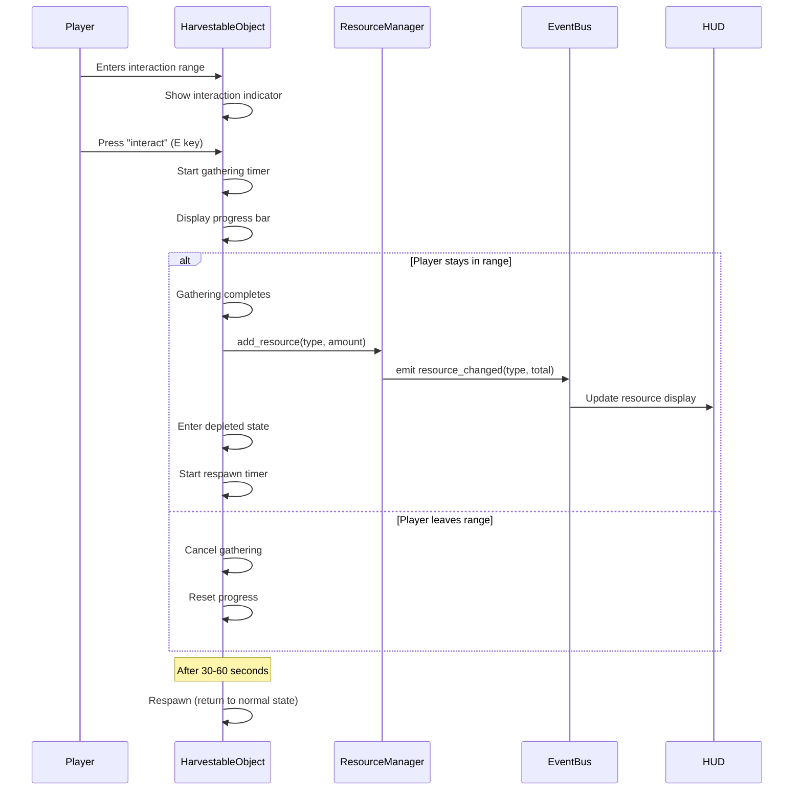
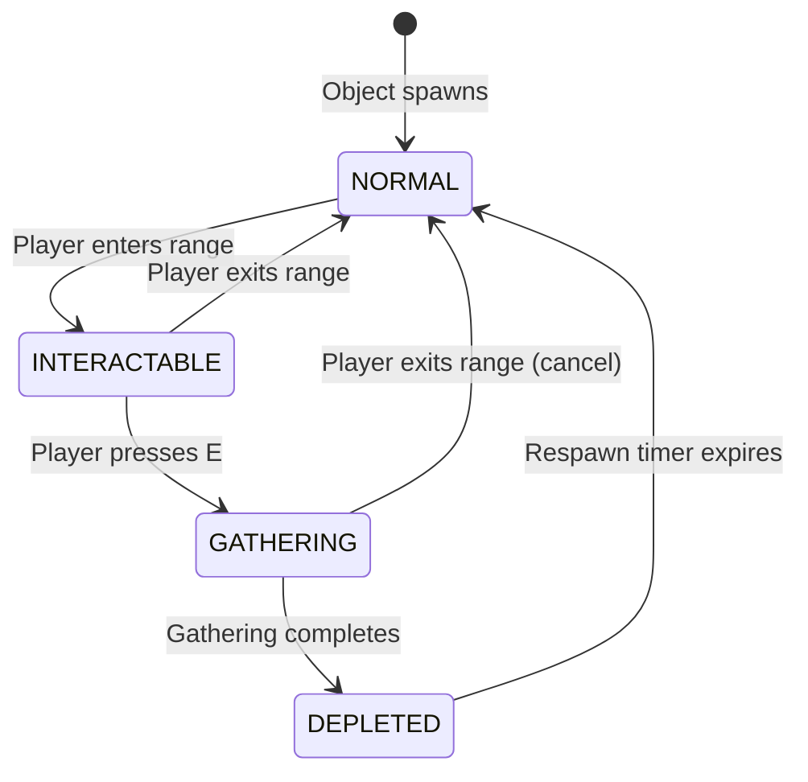

# Resource Gathering & Farming System - Design Document

**Version:** 1.0  
**Date:** 2026-04-16  
**Status:** Draft

---

## Overview

The Resource Gathering & Farming System introduces environmental resource nodes (trees, rocks, bushes) to the game world, enabling players to harvest materials through timed interactions. The system integrates seamlessly with the existing ResourceManager autoload and EventBus signal architecture, providing visual feedback during gathering operations and implementing a respawn mechanism to ensure continuous resource availability.

### Design Goals

1. **Simplicity**: Use ColorRect placeholders for all visual elements (no sprite assets required)
2. **Integration**: Leverage existing systems (ResourceManager, EventBus, input actions) without modification
3. **Feedback**: Provide clear visual indicators for interaction availability, gathering progress, and object state
4. **Sustainability**: Implement respawn mechanics to prevent resource exhaustion
5. **Extensibility**: Design component structure to easily add new harvestable object types

### Key Features

- **Three Resource Types**: Trees (wood), Rocks (stone), Bushes (meat)
- **Proximity Detection**: 50-pixel interaction range with visual indicators
- **Timed Gathering**: 1-3 second gathering duration with progress bar
- **Cancellable Actions**: Player can move away to cancel gathering
- **Respawn System**: 30-60 second cooldown after harvest
- **Visual States**: Normal, interactable, gathering, depleted
- **Resource Distribution**: 1-3 resources per successful harvest

---

## Architecture

### System Components

```
Prototype_World (Node2D)
├── YSortRoot (Node2D, y_sort_enabled=true)
│   ├── Player (CharacterBody2D)
│   ├── HarvestableObjectSpawner (Node)
│   └── [Harvestable Objects]
│       ├── Tree (Area2D) → HarvestableObject script
│       ├── Rock (Area2D) → HarvestableObject script
│       └── Bush (Area2D) → HarvestableObject script
```

### Component Responsibilities

| Component | Responsibility |
|-----------|---------------|
| **HarvestableObjectSpawner** | Spawns harvestable objects at valid positions on map load |
| **HarvestableObject** | Base script for all harvestable objects; handles interaction detection, gathering logic, state management, and respawn |
| **Tree/Rock/Bush Scenes** | Specific harvestable object instances with unique visuals and resource types |
| **ResourceManager** | Existing autoload; receives resource additions from harvestable objects |
| **EventBus** | Existing autoload; emits resource_changed signals |
| **Player** | Existing; triggers "interact" input action when near objects |

### Data Flow



---

## Components and Interfaces

### 1. HarvestableObjectSpawner

**Type**: Node (attached to Prototype_World)

**Purpose**: Spawns harvestable objects at random valid positions when the world loads.

**Properties**:
```gdscript
@export var tree_scene: PackedScene
@export var rock_scene: PackedScene
@export var bush_scene: PackedScene
@export var min_spawn_count: int = 5  # Minimum of each type
@export var map_size: Vector2 = Vector2(960, 960)  # 30x30 tiles * 32 pixels
@export var spawn_margin: float = 50.0  # Distance from map edges
@export var min_object_spacing: float = 80.0  # Minimum distance between objects
```

**Methods**:
```gdscript
func _ready() -> void:
    # Spawn objects when world loads
    spawn_objects()

func spawn_objects() -> void:
    # Spawn minimum count of each object type
    spawn_object_type(tree_scene, min_spawn_count)
    spawn_object_type(rock_scene, min_spawn_count)
    spawn_object_type(bush_scene, min_spawn_count)

func spawn_object_type(scene: PackedScene, count: int) -> void:
    # Spawn 'count' instances of the given scene at valid positions
    for i in range(count):
        var position = get_valid_spawn_position()
        var instance = scene.instantiate()
        instance.global_position = position
        get_parent().get_node("YSortRoot").add_child(instance)

func get_valid_spawn_position() -> Vector2:
    # Generate random position within map bounds
    # Check against existing objects to ensure min_object_spacing
    # Retry if position is invalid (max 50 attempts)
    # Return valid position or fallback position
```

**Integration Points**:
- Accesses `YSortRoot` node in Prototype_World
- Instantiates Tree, Rock, and Bush scenes
- Runs once on `_ready()`

---

### 2. HarvestableObject (Base Script)

**Type**: Area2D script (attached to Tree, Rock, Bush scenes)

**Purpose**: Manages interaction detection, gathering process, state transitions, and respawn logic.

**Exported Properties**:
```gdscript
@export var resource_type: String = "wood"  # "wood", "stone", or "meat"
@export var min_resource_amount: int = 1
@export var max_resource_amount: int = 3
@export var gathering_time: float = 2.0  # Seconds (randomized 1-3 on spawn)
@export var respawn_time: float = 45.0  # Seconds (randomized 30-60 on harvest)
@export var interaction_range: float = 50.0  # Pixels
@export var normal_color: Color = Color.GREEN
@export var interactable_color: Color = Color.YELLOW
@export var depleted_color: Color = Color.GRAY
```

**Internal State**:
```gdscript
enum State { NORMAL, INTERACTABLE, GATHERING, DEPLETED }
var current_state: State = State.NORMAL
var player_in_range: bool = false
var player_ref: Node2D = null
var gathering_progress: float = 0.0
var gathering_timer: float = 0.0
var respawn_timer: float = 0.0
```

**Node References**:
```gdscript
@onready var visual: ColorRect = $Visual
@onready var interaction_indicator: ColorRect = $InteractionIndicator
@onready var progress_bar: ColorRect = $ProgressBar
@onready var progress_fill: ColorRect = $ProgressBar/Fill
@onready var collision_shape: CollisionShape2D = $CollisionShape2D
```

**Methods**:

```gdscript
func _ready() -> void:
    # Randomize gathering and respawn times
    gathering_time = randf_range(1.0, 3.0)
    respawn_time = randf_range(30.0, 60.0)
    
    # Connect Area2D signals
    body_entered.connect(_on_body_entered)
    body_exited.connect(_on_body_exited)
    
    # Initialize visual state
    update_visual_state()
    interaction_indicator.visible = false
    progress_bar.visible = false

func _process(delta: float) -> void:
    match current_state:
        State.INTERACTABLE:
            check_for_interact_input()
        State.GATHERING:
            update_gathering(delta)
        State.DEPLETED:
            update_respawn(delta)

func _on_body_entered(body: Node2D) -> void:
    if body.is_in_group("player") and current_state == State.NORMAL:
        player_in_range = true
        player_ref = body
        transition_to_state(State.INTERACTABLE)

func _on_body_exited(body: Node2D) -> void:
    if body.is_in_group("player"):
        player_in_range = false
        player_ref = null
        if current_state == State.INTERACTABLE:
            transition_to_state(State.NORMAL)
        elif current_state == State.GATHERING:
            cancel_gathering()

func check_for_interact_input() -> void:
    if Input.is_action_just_pressed("interact"):
        start_gathering()

func start_gathering() -> void:
    transition_to_state(State.GATHERING)
    gathering_progress = 0.0
    gathering_timer = 0.0
    progress_bar.visible = true
    update_progress_bar()

func update_gathering(delta: float) -> void:
    gathering_timer += delta
    gathering_progress = gathering_timer / gathering_time
    update_progress_bar()
    
    # Check if player moved out of range
    if not player_in_range:
        cancel_gathering()
        return
    
    # Check if gathering complete
    if gathering_progress >= 1.0:
        complete_gathering()

func cancel_gathering() -> void:
    transition_to_state(State.NORMAL)
    gathering_progress = 0.0
    gathering_timer = 0.0
    progress_bar.visible = false

func complete_gathering() -> void:
    # Add resources to ResourceManager
    var amount = randi_range(min_resource_amount, max_resource_amount)
    ResourceManager.add_resource(resource_type, amount)
    
    # Transition to depleted state
    transition_to_state(State.DEPLETED)
    progress_bar.visible = false
    respawn_timer = 0.0

func update_respawn(delta: float) -> void:
    respawn_timer += delta
    if respawn_timer >= respawn_time:
        respawn()

func respawn() -> void:
    transition_to_state(State.NORMAL)
    # Re-randomize timers for next harvest
    gathering_time = randf_range(1.0, 3.0)
    respawn_time = randf_range(30.0, 60.0)

func transition_to_state(new_state: State) -> void:
    current_state = new_state
    update_visual_state()

func update_visual_state() -> void:
    match current_state:
        State.NORMAL:
            visual.color = normal_color
            visual.modulate.a = 1.0
            interaction_indicator.visible = false
            collision_shape.disabled = false
        State.INTERACTABLE:
            visual.color = interactable_color
            visual.modulate.a = 1.0
            interaction_indicator.visible = true
            collision_shape.disabled = false
        State.GATHERING:
            visual.color = interactable_color
            visual.modulate.a = 1.0
            interaction_indicator.visible = false
            collision_shape.disabled = false
        State.DEPLETED:
            visual.color = depleted_color
            visual.modulate.a = 0.5
            interaction_indicator.visible = false
            collision_shape.disabled = true

func update_progress_bar() -> void:
    var fill_width = progress_bar.size.x * gathering_progress
    progress_fill.size.x = fill_width
```

**Signal Connections**:
- `body_entered` → `_on_body_entered`
- `body_exited` → `_on_body_exited`

**Integration Points**:
- Calls `ResourceManager.add_resource(type, amount)`
- Reads `Input.is_action_just_pressed("interact")`
- Checks `body.is_in_group("player")`

---

### 3. Tree Scene (Tree.tscn)

**Structure**:
```
Tree (Area2D) [script: harvestable_object.gd]
├── CollisionShape2D (CircleShape2D, radius=20)
├── Visual (ColorRect, size=32x48, color=brown)
├── InteractionIndicator (ColorRect, size=40x4, color=white, position above object)
└── ProgressBar (ColorRect, size=40x6, color=black, position above indicator)
    └── Fill (ColorRect, size=0x6, color=green)
```

**Exported Property Overrides**:
```gdscript
resource_type = "wood"
normal_color = Color(0.55, 0.35, 0.2)  # Brown
interactable_color = Color(0.8, 0.6, 0.3)  # Light brown
depleted_color = Color(0.3, 0.2, 0.1)  # Dark brown
```

---

### 4. Rock Scene (Rock.tscn)

**Structure**:
```
Rock (Area2D) [script: harvestable_object.gd]
├── CollisionShape2D (CircleShape2D, radius=18)
├── Visual (ColorRect, size=36x28, color=gray)
├── InteractionIndicator (ColorRect, size=40x4, color=white)
└── ProgressBar (ColorRect, size=40x6, color=black)
    └── Fill (ColorRect, size=0x6, color=green)
```

**Exported Property Overrides**:
```gdscript
resource_type = "stone"
normal_color = Color(0.6, 0.6, 0.65)  # Gray
interactable_color = Color(0.8, 0.8, 0.85)  # Light gray
depleted_color = Color(0.3, 0.3, 0.35)  # Dark gray
```

---

### 5. Bush Scene (Bush.tscn)

**Structure**:
```
Bush (Area2D) [script: harvestable_object.gd]
├── CollisionShape2D (CircleShape2D, radius=16)
├── Visual (ColorRect, size=28x24, color=green)
├── InteractionIndicator (ColorRect, size=40x4, color=white)
└── ProgressBar (ColorRect, size=40x6, color=black)
    └── Fill (ColorRect, size=0x6, color=green)
```

**Exported Property Overrides**:
```gdscript
resource_type = "meat"
normal_color = Color(0.2, 0.6, 0.3)  # Green
interactable_color = Color(0.4, 0.8, 0.5)  # Light green
depleted_color = Color(0.1, 0.3, 0.15)  # Dark green
```

---

## Data Models

### HarvestableObject State Machine



### Resource Type Mapping

| Object Type | Resource Type | Color (Normal) | Min Amount | Max Amount |
|-------------|---------------|----------------|------------|------------|
| Tree | "wood" | Brown (0.55, 0.35, 0.2) | 1 | 3 |
| Rock | "stone" | Gray (0.6, 0.6, 0.65) | 1 | 3 |
| Bush | "meat" | Green (0.2, 0.6, 0.3) | 1 | 3 |

### Spawn Configuration

| Parameter | Value | Notes |
|-----------|-------|-------|
| Map Size | 960x960 pixels | 30x30 tiles at 32 pixels per tile |
| Spawn Margin | 50 pixels | Distance from map edges |
| Min Object Spacing | 80 pixels | Minimum distance between objects |
| Min Spawn Count | 5 per type | Trees, Rocks, Bushes |
| Total Objects | 15+ | Can spawn more if space allows |

---

## Error Handling

### Spawn Failures

**Problem**: Unable to find valid spawn position after max attempts.

**Solution**:
```gdscript
func get_valid_spawn_position() -> Vector2:
    var max_attempts = 50
    for attempt in range(max_attempts):
        var pos = Vector2(
            randf_range(spawn_margin, map_size.x - spawn_margin),
            randf_range(spawn_margin, map_size.y - spawn_margin)
        )
        if is_position_valid(pos):
            return pos
    
    # Fallback: return center of map with random offset
    push_warning("[HarvestableObjectSpawner] Could not find valid position, using fallback")
    return map_size / 2 + Vector2(randf_range(-100, 100), randf_range(-100, 100))
```

### Missing Player Reference

**Problem**: Player node not found or not in "player" group.

**Solution**:
```gdscript
func _on_body_entered(body: Node2D) -> void:
    if not body.is_in_group("player"):
        return  # Ignore non-player bodies
    
    if current_state != State.NORMAL:
        return  # Only respond in NORMAL state
    
    player_in_range = true
    player_ref = body
    transition_to_state(State.INTERACTABLE)
```

### Invalid Resource Type

**Problem**: HarvestableObject configured with unknown resource type.

**Solution**:
```gdscript
func complete_gathering() -> void:
    var amount = randi_range(min_resource_amount, max_resource_amount)
    
    # Validate resource type before adding
    if not resource_type in ["wood", "stone", "meat"]:
        push_error("[HarvestableObject] Invalid resource type: %s" % resource_type)
        return
    
    ResourceManager.add_resource(resource_type, amount)
    transition_to_state(State.DEPLETED)
```

### Node Reference Failures

**Problem**: Required child nodes (Visual, ProgressBar, etc.) not found.

**Solution**:
```gdscript
func _ready() -> void:
    # Validate node structure
    if not has_node("Visual"):
        push_error("[HarvestableObject] Missing Visual node")
        queue_free()
        return
    
    if not has_node("ProgressBar/Fill"):
        push_error("[HarvestableObject] Missing ProgressBar/Fill node")
        queue_free()
        return
    
    # Continue with initialization...
```

### Respawn Timer Edge Cases

**Problem**: Object respawns while player is still in range.

**Solution**:
```gdscript
func respawn() -> void:
    # Check if player is still in range before respawning
    if player_in_range:
        transition_to_state(State.INTERACTABLE)
    else:
        transition_to_state(State.NORMAL)
    
    # Re-randomize timers
    gathering_time = randf_range(1.0, 3.0)
    respawn_time = randf_range(30.0, 60.0)
```

---

## Testing Strategy

### Unit Tests

**Focus**: Specific behaviors and edge cases for individual components.

**Test Cases**:

1. **HarvestableObjectSpawner**:
   - Spawns minimum count of each object type
   - Spawned objects are within map bounds
   - Spawned objects maintain minimum spacing
   - Fallback position used after max spawn attempts

2. **HarvestableObject State Transitions**:
   - NORMAL → INTERACTABLE when player enters range
   - INTERACTABLE → NORMAL when player exits range
   - INTERACTABLE → GATHERING when interact pressed
   - GATHERING → DEPLETED when gathering completes
   - GATHERING → NORMAL when player exits range (cancel)
   - DEPLETED → NORMAL after respawn timer

3. **Resource Distribution**:
   - Tree adds 1-3 wood to ResourceManager
   - Rock adds 1-3 stone to ResourceManager
   - Bush adds 1-3 meat to ResourceManager
   - ResourceManager emits resource_changed signal

4. **Gathering Cancellation**:
   - Progress resets to 0 when cancelled
   - Progress bar hidden when cancelled
   - State returns to NORMAL after cancellation

5. **Visual State Updates**:
   - Visual color changes match state
   - Interaction indicator visible only in INTERACTABLE state
   - Progress bar visible only in GATHERING state
   - Depleted objects have reduced opacity

6. **Edge Cases**:
   - Invalid resource type logs error and skips addition
   - Missing child nodes cause graceful failure
   - Player respawn while in range transitions to INTERACTABLE

### Integration Tests

**Focus**: Interaction between gathering system and existing game systems.

**Test Cases**:

1. **ResourceManager Integration**:
   - Gathering wood increases ResourceManager.resources["wood"]
   - EventBus.resource_changed emitted with correct type and amount
   - HUD updates to reflect new resource totals

2. **Input System Integration**:
   - "interact" action (E key) triggers gathering
   - Input only processed in INTERACTABLE state
   - Input ignored in other states

3. **YSort Integration**:
   - Harvestable objects render in correct layer order
   - Objects behind player appear behind
   - Objects in front of player appear in front

4. **Player Movement Integration**:
   - Player can move freely while gathering
   - Moving out of range cancels gathering
   - Collision shapes don't block player movement

### Manual Testing

**Focus**: Visual feedback, game feel, and user experience.

**Test Scenarios**:

1. **Visual Feedback**:
   - Interaction indicator clearly visible when in range
   - Progress bar smoothly fills during gathering
   - Color changes are noticeable and intuitive
   - Depleted objects visually distinct from active objects

2. **Timing and Feel**:
   - Gathering time (1-3 seconds) feels appropriate
   - Respawn time (30-60 seconds) balanced for gameplay
   - Interaction range (50 pixels) comfortable for player

3. **Spawn Distribution**:
   - Objects distributed across map without clustering
   - No objects spawn in inaccessible areas
   - Minimum 5 of each type always present

4. **Edge Case Scenarios**:
   - Multiple objects in range (only nearest interactable)
   - Rapid enter/exit of interaction range
   - Spamming interact key during gathering
   - Player death during gathering

### Performance Testing

**Focus**: System performance with multiple objects and concurrent interactions.

**Test Cases**:

1. **Spawn Performance**:
   - 15+ objects spawn without frame drops
   - Spawn algorithm completes in <100ms

2. **Runtime Performance**:
   - 15+ objects updating per frame maintains 60 FPS
   - State machine transitions have negligible overhead
   - Progress bar updates don't cause visual stuttering

3. **Memory Usage**:
   - No memory leaks from repeated spawn/despawn cycles
   - Object pooling not required for 15-20 objects

---

## Implementation Notes

### Why Property-Based Testing Is Not Applicable

Property-based testing (PBT) is designed for testing pure functions with universal properties that hold across all inputs. This gathering system is **not suitable for PBT** because:

1. **Stateful Game Logic**: The system manages complex state transitions (NORMAL → INTERACTABLE → GATHERING → DEPLETED) that depend on player position, input timing, and timers. These are not pure functions.

2. **UI and Visual Feedback**: The system heavily relies on visual elements (ColorRect transformations, progress bars, color changes) that cannot be verified through universal properties.

3. **External Dependencies**: The system integrates with ResourceManager, EventBus, and player input, making it dependent on external state and side effects.

4. **Time-Based Behavior**: Gathering and respawn timers introduce non-deterministic behavior that varies with delta time and randomization.

5. **Integration Testing Focus**: The value of this system lies in how it integrates with existing game systems, not in universal mathematical properties.

**Appropriate Testing Approach**:
- **Example-based unit tests** for specific state transitions and behaviors
- **Integration tests** for ResourceManager and EventBus interactions
- **Manual testing** for visual feedback and game feel
- **Performance tests** for spawn algorithms and runtime efficiency

### Development Phases

**Phase 1: Core Components**
1. Create HarvestableObject base script with state machine
2. Create Tree, Rock, Bush scenes with ColorRect visuals
3. Implement interaction detection and state transitions

**Phase 2: Gathering Mechanics**
1. Implement gathering timer and progress tracking
2. Add progress bar visual feedback
3. Implement gathering cancellation on range exit

**Phase 3: Resource Integration**
1. Connect to ResourceManager.add_resource()
2. Verify EventBus.resource_changed emission
3. Test resource distribution (1-3 per harvest)

**Phase 4: Respawn System**
1. Implement depleted state and visual changes
2. Add respawn timer and state restoration
3. Test respawn with player in/out of range

**Phase 5: Spawner**
1. Create HarvestableObjectSpawner script
2. Implement spawn position validation
3. Add to Prototype_World and test distribution

**Phase 6: Polish**
1. Tune colors and visual feedback
2. Adjust timing values for game feel
3. Add error handling and edge case fixes

### Extension Points

**Adding New Harvestable Types**:
1. Create new scene (e.g., `Flower.tscn`) inheriting from HarvestableObject
2. Set `resource_type` to new type (e.g., "pollen")
3. Add new resource type to ResourceManager.resources dictionary
4. Add scene to HarvestableObjectSpawner export variables
5. Update spawn_objects() to include new type

**Adding Gathering Tools**:
1. Add `required_tool: String` export to HarvestableObject
2. Check player inventory for tool in `check_for_interact_input()`
3. Modify gathering_time based on tool quality
4. Add tool durability reduction on successful harvest

**Adding Particle Effects**:
1. Add CPUParticles2D or GPUParticles2D nodes to scenes
2. Trigger particles in `start_gathering()` and `complete_gathering()`
3. Use ColorRect-based particles for consistency with art style

---

## Conclusion

This design provides a complete, extensible resource gathering system that integrates seamlessly with existing game systems. The use of ColorRect placeholders ensures rapid prototyping without art asset dependencies, while the state machine architecture allows for easy extension with new object types, tools, and mechanics. The testing strategy focuses on example-based unit tests and integration tests, which are appropriate for this stateful, UI-driven game system.

